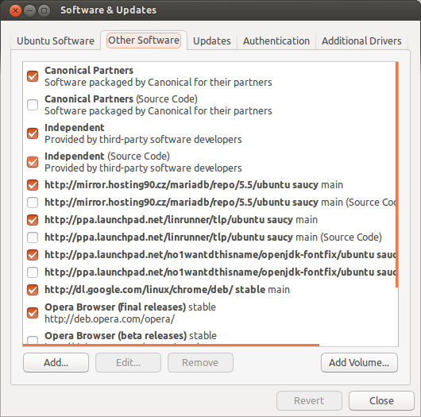

.. _instalace-sprava-programu:

Instalace a správa programů
***************************

V této kapitole se zaměříme na možnosti instalace a správy aplikací v Linuxu, a odlišnosti Linuxu a
ostatních OS.

.. important:: Protože velkou pozornost budeme věnovat balíčkovacímu systému DEB bude tato kapitola
   jako jediná téměř výhradně specifická pro systémy Debian a Ubuntu.

Kompilace
=========

Kompilace byla tradiční a dlouho jediná možnost, jak získat pro náš počítač nový software.

*Kompilace neboli překlad* je převod zdrojových kódů (většinou v jazyce C nebo C++) do *strojového
kódu* vašeho procesoru. Jistě víte, že Linux sám i většina programů pro Linux je open-source, tedy
volně šiřitelná včetně zdrojových kódů. Ze stránek aplikace proto stáhnete "zdrojáky" převážně jako
.tar.gz nebo je získáte přímo ze systému verzování kódu (VCS) jako Git, Subversion, CVS ap.

.. rubric:: Proč nekompilovat

Kompilace je však ta nejhorší možnost a měli byste se ji vyhnout, kdykoli můžete. Kompilace není
zrovna snadná ani pro zkušeného správce. Často skončíte záludnými chybějícími závislostmi na externí
knihovny nebo chybovými hláškami o kterých ani Google příliš neslyšel.

Kompilace je také časově náročná operace, která může trvat jednoty i desítky minut.

Poslední hlavní nevýhodou kompilace je, že nemáme žádnou skutečnou možnost programy aktualizovat a
odinstalovat (nevíme, jaké soubory tvoří program). Všechno závisí na "slušnosti" programu samotného.

.. rubric:: Příprava

Jedná-li se o C/C++ program (většinou), nainstalujte nejprve kompilátor, linker, make builder ap.::

	$ sudo apt-get install build-essential checkinstall

Možná budete potřebovat i verzovacího klienta (na 99,9% to bude CVS, SVN, Mercurial nebo dnes
nejpopulárnější Git)::

	$ sudo apt-get install cvs subversion mercurial git-core

.. rubric:: Stručný postup pro C/C++

Když už kompilovat musíte, popišme alespoň velmi stručně jak na to. Většina open-source projektů
používá GNU auto-tools se kterým má instalace ze zdrojáků tři kroky

1. *"configure"* (příkaz ``./configure [--volby...]``) -- ověření, že jsou dostupné všechny potřebné
   závislosti, konfigurace přes kompilace a výsledného programu. Můžete zkusit ``./configure --help`` pro zjištění všech sestavovacích a instalačních voleb.
2. *"make"* (příkaz ``make``) -- samotná kompilace
3. *"make install"* (příkaz ``checkinstall``) -- dnes je posledním krokem spíše `checkinstall`, ale ``make install`` je tak hluboko zakořeněn, že této fázi budeme takto říkat. Checkinstall vytváří DEB balíček (viz dále).

Více informací najdete např. na https://help.ubuntu.com/community/CompilingSoftware.

DEB balíčky
===========

Na všechny bolesti kompilace existuje lék v podobě DEB balíčků. Jsou to soubory s příponou ``.deb``
obsahující zkomprimovaně

* již zkompilované spustitelné soubory (binárky)
* konfigurační soubory
* administrativní údaje (licence, autor, web programu)
* systémové požadavky (architektura, jazyk ap.)
* závislosti na jiných balíčcích

Autor (správce) DEB balíčku si dal tu práci s kompilací pro naši architekturu za nás, odzkoušel
funkčnost programu, případně přizpůsobil pro specifika distribuce.

Výhody DEB balíčků
------------------

Další výhody balíčkovacích systému jako DEB jsou

* atomické operace -- jestliže se instalace nepovede, nemělo by dojít k ovlivnění systému, balíček
  můžete odstranit nebo instalaci opakovat.
* deklarace závislostí -- balíček říká "potřebuji tento a tamten balíček" a bez něj vám nedovolí
  instalaci (program by bez tak nefungoval). Není tedy zmatek v tom, kdo určitou knihovnu vlastně
  potřebuje, v jaké verzi atp.
* skripty -- DEB balíček může spouštět v různých okamžicích instalace skripty, takže někdy
  instalace může být mnohem více, než jen pouhé kopírování souborů z balíčku na disk
* snadné aktualizace -- balíčky jsou verzované. Když se pokusíte instalovat program novější verze,
  než máte, provede se jen aktualizace.
* seznam aplikací -- víte, co jste si nainstalovali
* odinstalace -- při odinstalaci jsou odstraněny všechny soubory, které balíček na váš počítač
  přidal. Systém je po odebrání balíčku většinou v prakticky identickém stavu (včetně volného
  místa) jako byl před instalací.

Celý Ubuntu a Debian je vlastně udržován jako soustava několika tisícovek balíčků. Dokonce i jádro
se distribuuje v podobě DEB balíčku. Již při instalaci se nekopírují soubory "jen tak", ale probíhá
instalace z příslušných balíčků.

.. _update-x-upgrade:

Update vs. upgrade
------------------

Měli bychom rozlišovat mezi těmito zdánlivě stejnými termíny. Zvýšení verze jednoho programu, resp.
balíčku nazýváme *update*. Update všech balíčků je *upgrade*, tj. vlastně celého operačního systému.

Nevýhody DEB balíčků
--------------------

Nevýhodou DEB balíčků (ale i konkurenčních :ref:`RPM <rpm>`) je, že nemáte vždy nejnovější verze
programů. Zkrátka může nějaký čas trvat, než správce DEB balíčku příslušné aplikace vytvoří a
otestuje aktualizaci.

Některé programy bohužel jako balíčky nejsou dostupné a tak občas nezbývá, než "stará špatná"
kompilace.

Nástroj dpkg
------------

Pro manipulaci s DEB balíčky staženými z internetu ap. slouží nástroj dpkg. Důležité volby jsou
zejm.

* ``-i, --install`` pro instalaci, resp. update balíčku
* ``-r, --remove`` pro odinstalaci balíčku
* ``-P, --purge`` pro odinstalaci balíčku včetně konfiguračních souborů. Vhodné, když víte, že
  určitě už nebudete program nikdy provozovat.
* ``-l, --list`` výpis všech nainstalovaných balíčků. Výpis lze omezit na balíčky obsahující jen
  určitý výraz, např. ``-l nano``.
* ``-L, --listfiles`` velmi užitečný parametr, která vám řekne, jaké soubory určitý balíček
  obsahuje (kde budou uloženy po instalaci)
* ``--dry-run`` běh "na sucho" neboli jen simuluj, že se operace provádí. Dobré pro vyzkoušení, zda
  by instalace/odinstalace proběhla v pořádku. *Tento parametr musíte pochopitelně umístit před
  jakýkoli jiný, aby operace byla opravdu jen "jako".*

Příklad instalace a odinstalace (s ponecháním konf. souborů)::

	$ sudo dpkg -i super-aplikace.deb
	$ sudo dpkg -r super-aplikace.deb

Úprava konfigurace -- dpkg-reconfigure
--------------------------------------

Pokud se např. instalátor ptal na heslo správce aplikace a vy jste ho zapomněli, můžete opětovně
spustit instalaci a zadat nové heslo příkazem::

	$ sudo dpkg-reconfigure <balíček>

Možná si vzpomenete, že jsme už jednou dpkg-reconfigure použili ke změně rozložení klávesnice v
textovém prostředí::

	$ sudo dpkg-reconfigure keyboard-configuration

Repozitáře balíčků
==================

Repozitář je úložiště a katalog stovek až stovek tisíc balíčků, kterých může balíčkový systém znát
desítky. Jeden repozitář slouží např. na publikování výhradně bezpečnostní aktualizace OS, další pro
komerční nebo jinak licencovaný software, další hry ap. Existují i repozitáře o jednom balíčku.
Běžné ve větších organizacích se může vyplatit vnitofiremní repozitář s programy používanými v
organizaci.

V repozitářích bývá více variant stejného balíčku stejné verze pro všechny podporované procesorové
architektury, jazyky, balíček se zdrojovými kódy ap.

Instalace jednotlivých balíčků stažených z internetu nástrojem dpkg můžeme proto spíše považovat
nízkoúrovňovou operaci a za základ pro řešení repozitářů balíčků.

Systém repozitářů zjednodušuje vyhledávání a instalaci balíků. Požadovaný program vyhledává ve
známých repozitářích. Pokud balíček závisí na dalších balíčcích, tak je zkusí rovněž najít a
stáhnout v dostupných repozitářích.

Program na správu repozitářů také sám kontroluje, zda není v repozitářích novější verze softwaru,
než máme nainstalován a případně nabídne jeho update.

.. note:: Ano, tento princip je velmi podobný Google Play, App Store ap., ale v Linuxu existují
   tyto "obchody" již desítku let.

Repozitáře jsou zkrátka prvním místem, kde hledat nové programy.

Správce repozitářů APT
======================

Jedním z nejvyspělejších systémů pro správu repozitářů je APT - Advanced Packaging Tool. APT vznikl
původně v Debianu a používá ho tedy Ubuntu, ale existují i porty pro distribuce mimo Debian a
dokonce i pro RPM balíčky.

APT je ve skutečnosti několikero programů apt-<něco>.

apt-get
-------

Základním příkazem správce APT je ``apt-get``. U všech variant příkazu můžete zadat jeden nebo více
balíčků oddělených mezerou.

Instalace programu::

	$ sudo apt-get install balíček [balíček2...]

Odstranění::

	$ sudo apt-get remove balíček [balíček2...]

Odstranění včetně konfiguračních souborů::

	$ sudo apt-get purge balíček [balíček2...]

Pro povýšení na novější verzi nebo po přidání nového repozitáře do ``/etc/apt/sources.list`` (viz dále) musíme obnovit lokální cache podle skutečného stavu repozitářů. Příkazy proto budou dva - obnova cache volbou ``update``, a pak samotná instalace::

	$ sudo apt-get update
	$ sudo apt-get install balíček [balíček2...]

.. important:: Obnova cache (``apt-get update``) je jen dotaz, zda neexistují aktualizace balíčků,
   které máme a detekce úplně nově přidaných balíčků v repozitářích. Až druhý příkaz ``apt-get
   install`` provede skutečnou aktualizaci, resp. instalaci pro nový balíček.

apt-key
-------

Správa klíčů používaných pro ověřování autenticity balíčků. Jen balíčky ověřené těmito klíči jsou považovány za důvěryhodné.

apt-cache
---------

Dotazování nad APT cachí balíčků.

Repozitář pod lupou
===================

Repozitář je místo v lokální síti nebo internetu dostupné pod URL, která je známá programům pro
správu repozitářů jako APT (viz dále).

Repozitáře jsou konfigurovány textovými soubory v ``/etc/apt/``, z nichž nejdůležitější je ``/etc/apt/sources.list`` obsahující údaje o

* typu balíčku (je vždy ``deb`` nebo ``deb-src`` pro zdrojové balíčky)
* URL HTTP nebo FTP v internetu či intranetu, ale i na CD-ROM. URL většinou směřuje na lokální obraz (mirror) download serveru pro váš stát
* označení pro jakou verzi vaší distribuce jsou balíčky určeny

.. code-block:: none
   :caption: Soubor ``/etc/apt/sources.list`` (zkráceno a vynechány komentáře)

   deb http://cz.archive.ubuntu.com/ubuntu/ saucy main restricted
   deb-src http://cz.archive.ubuntu.com/ubuntu/ saucy main restricted

   deb http://cz.archive.ubuntu.com/ubuntu/ saucy-updates main restricted
   deb-src http://cz.archive.ubuntu.com/ubuntu/ saucy-updates main restricted

   deb http://cz.archive.ubuntu.com/ubuntu/ saucy universe
   deb-src http://cz.archive.ubuntu.com/ubuntu/ saucy universe
   deb http://cz.archive.ubuntu.com/ubuntu/ saucy-updates universe
   deb-src http://cz.archive.ubuntu.com/ubuntu/ saucy-updates universe
   ...

Klidně si některou URL otevřete ve webovém prohlížeči a podívejte se jak vypadá "formát" DEB
repozitáře.

Připomínáme, že jakmile upravíte ``sources.list``, musíte provést ``sudo apt-get update`` pro obnovu
informací o balíčcích v cache.

.. tip:: Jednoduše procházet a vyhledávat můžete standardní repozitáře distribuce také přes web na http://packages.ubuntu.com, resp. http://packages.debian.org.

Další programy pro repozitáře
=============================

Software & Updates
------------------

Repozitáře v případe Ubuntu Desktop můžete spravovat i graficky v nástroji Software & Updates.

   Správce repozitářů Software & Updates

Ubuntu Software Center
----------------------

Grafické Ubuntu Desktop obsahuje repozitářového klienta Ubuntu Software Center.

   Ubuntu Software Center

Aptitude
--------

Pro textové rozhraní ještě doporučujeme doinstalovat Aptitude, který by se dal přirovnat k Ubuntu Software Center a control panelu Software & Updates::

	$ sudo apt-get install aptitude
	$ aptitude

Při řešení problémů závislostí (chybějící, kolidující) je dokonce Aptitude chytřejší, než standardní
apt-get.

.. figure::img/aptitude.png

   Aptitude správce balíčků a repozitářů

.. todo: PPA archívy a Snapy

.. _rpm:

RPM balíčky
===========

Kromě výše probraných balíčků a repozitářů DEB pro rodiny Debian a Ubuntu Linuxu, byste měli vědět o
existenci balíčků RPM (Redhat Package Manager) původně vytvořený pro Redhat Linux, ale dnes
používaný i v dalších distribucích (Fedora, SUSE).

Všechny popsané výhody, nevýhody a princip je velmi podobný DEB systému. Narazíte-li na program pro
který existuje jen RPM balíček je možné jej jako *nouzové řešení* převést programem alien na DEB.
Alien samozřejmě nekontroluje obsah, ale jen převádí formát z RPM na DEB. Zda bude tento balíček
skutečně fungovat není jisté.

.. code-block:: bash

   # Instalace konvertoru alien
   $ sudo apt-get install alien

   # Převod
   $ alien balicek.rpm

Jako nízkoúrovnový ekvivalent dpkg pro RPM systémy slouží program yum::

	$ yum install super-aplikace

.. todo: Aktualizovat o informaci o dnf, který nahradil yum, a od jaké verze Fedory.