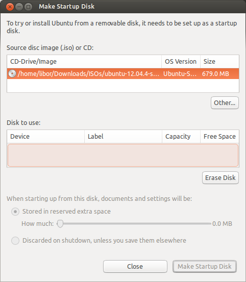
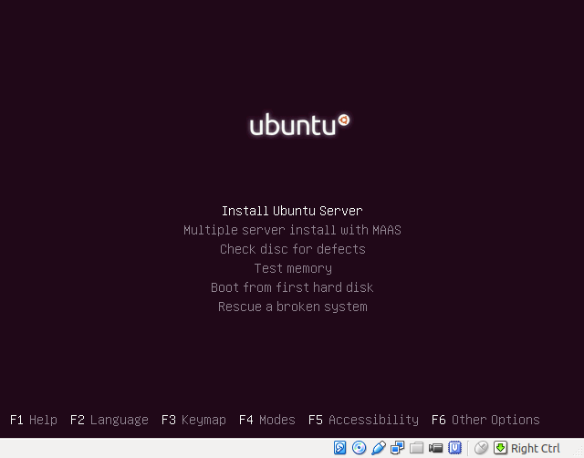
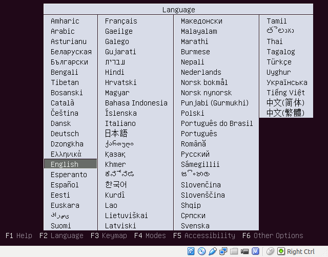
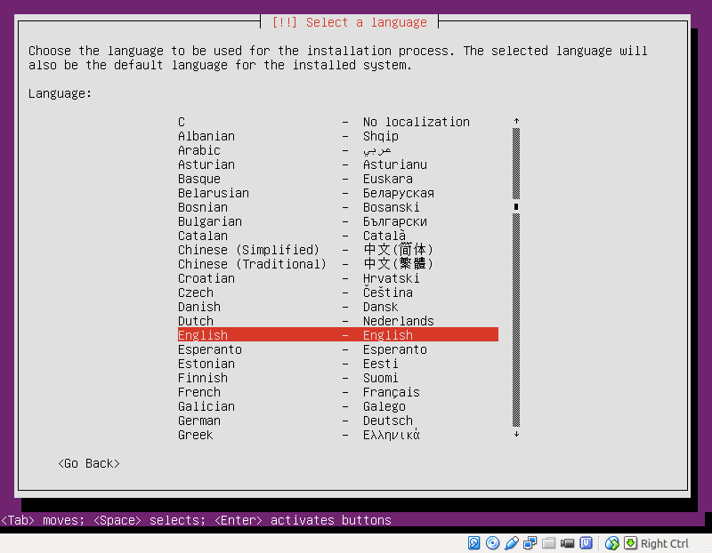
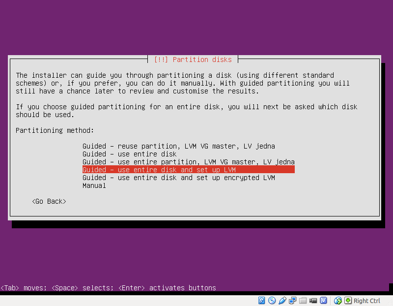
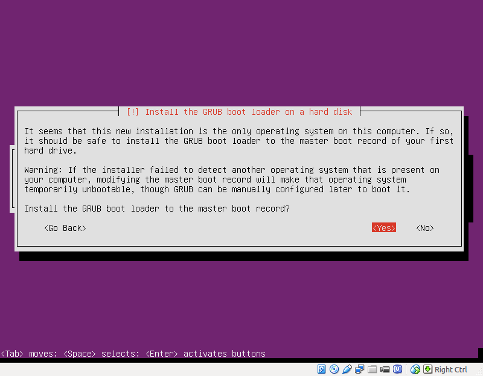

Instalace
*********

Všechny následující postupy můžete uplatnit samozřejmě rovnou na váš počítač, ale doporučujeme 
instalaci a první kroky v Ubuntu zkoušet v prostředí virtuálního počítače. Můžete použít volně 
dostupný virtualizační software `Virtual Box <http://www.virtualbox.org>`_, který existuje pro 
Linux, Mac i Windows. Případně jemu podobný (ale placený) VMware. Nástroj Microsoft Virtual PC 
nedoporučujeme vzhledem ke špatné podpoře Linuxových hostů.

.. note:: Obrázky uvedené u následujících odstavců jsou z Ubuntu 16.04 LTS Server, ale kroky 
   instalátoru jsou téměř identické s grafickou verzí setupu pro Ubuntu Desktop.

Výběr architektury
==================

Pod architekturou myslíme typ procesoru. V dnešních PC a serverech se můžete setkat s procesorovými
architekturami, které jsou v Ubuntu označované následujícími zkratkami.

+--------------+----------------------------------------------------------------------------------------------------------------------------------------------+
| Architektura | Popis                                                                                                                                        |
+==============+==============================================================================================================================================+
| i386         | 32bitové CPU starších počítačů                                                                                                               |
+--------------+----------------------------------------------------------------------------------------------------------------------------------------------+
| amd64        | 64bitové CPU dnešních počítačů. Jsou takto označené CPU od AMD i Intelu. Rovněž počítače s UEFI firmwarem (přeinstalovaný Windows 8 nebo 10) |
+--------------+----------------------------------------------------------------------------------------------------------------------------------------------+
| amd64+mac    | Ubuntu můžete provozovat místo OS X na Mac počítači nebo laptopu                                                                             |
+--------------+----------------------------------------------------------------------------------------------------------------------------------------------+

Mezi další podporované CPU architektury patří např. ARM procesory.

.. tip::

   .. rubric:: Jak zjistit "bitovost" mého CPU?

   V dnešní době je téměř jisté, že váš počítač podporuje 64bitové instrukce. Častou chybou je plést
   bitovost OS a CPU, protože můžete mít 64bitový CPU, ale nainstalován 32bitový OS.

   Chcete-li si být jisti, že jakou architekturu má CPU, proveďte z Ubuntu nebo jiného Linuxu
   příkaz ``lscpu``. Je-li v řádku ``Architecture`` hodnota ``x86_64`` je váš CPU 64bitový.

   Pro Windows si stáhněte např. program `CPU-Z <http://www.cpuid.com/softwares/cpu-z.html>`_.

Kde stáhnout
============

Doporučujeme instalátor stáhnout z českých stránek `Ubuntu.cz <http://www.ubuntu.cz/ziskejte/stahnout>`_.
Možná ještě lepší je http://releases.ubuntu.cz/, kde najdete všechny starší i aktuální verze a
všechny jejich deriváty a edice na jednom místě. Další možností je stažení prostřednictvím
BitTorrentu.

Instalátor je vždy v podobě ISO souboru, tedy bitové kopie disku. Jméno souboru obsahuje verzi,
edici a označení architektury. Např. +ubuntu-14.04-server-amd64.iso+ je Ubuntu 14.04 LTS Server pro
64bitové počítače.

.. tip:: Pokud si nejste jisti jakou architekturu zvolit, vyberte si 64bitovou.

Instalační média
================

.. rubric:: CD/DVD

Asi vás překvapí malá velikost ISO souboru (hlavně pokud jste zvyklí na instalátory Windows a
Mac OS X). Pro Ubuntu Desktop dlouho platilo, že to bylo 700 MB, aby se ISO dal vypálit na staré
dobré CD. Dnes už je velikost větší a použít proto musíme DVD(+-)R. Např. Ubuntu Server 16.04 má
kolem 800 MB.

.. rubric:: USB flash

Kromě této tradiční metody můžete provést instalaci z USB flash disku. Přenos ISO souboru na USB i
samotná instalace je mnohonásobně rychlejší (a tišší :-)), než instalace z CD/DVD.

Z již existující instalace Ubuntu použijte program *Startup Disk Creator* (z příkazové řádky 
``usb-creator-gtk``).

Pro Windows a Mac můžete zkusit třeba program `Unetbootin <http://unetbootin.sourceforge.net/>`_.
Ten umí "vypálit" na USB již dříve stažené ISO a taktéž sám ISO stáhnout i vypálit.

.. rubric:: Síťová instalace (Netboot)

Neobvyklou metodou je instalace prostřednictvím sítě zvaná Netboot. Více informací najdete např. na
https://help.ubuntu.com/community/Installation/Netboot.

.. rubric:: Wubi

*Wubi* nebo *Windows UBuntu Installer* nabízí možnost, jak nainstalovat Ubuntu na stávající disk
Windows bez nutnosti rozdělovat oddíly. Jinými slovy je to výborná možnost jak zkusit Ubuntu přímo
na PC nevirtualizovaně.

Wubi nainstaluje Ubuntu do (z pohledu Windows) jediného obrovského souboru na vybraném existujícím
disku Windows. Při každém startu si budete moci vybrat, zda načíst běžné Windows nebo Ubuntu.

.. TODO: je ještě wubi podporováno??

Upgrade
=======

Pokud už máte nainstalováno Ubuntu nemusíte ho smazat a provádět čistou instalaci. Pro server nebo
dlouho používaný desktop je to sice možnost jak "vyčistit" počítač, ale na druhou stranu Ubuntu ani
zdaleka netrpí tolik známou bolestí Windows, kdy se starší instalace stává pomalejší a pomalejší.

Rozhodnete-li se pro upgrade na vyšší verzi Ubuntu použijte příkaz ``do-release-upgrade``. Některé
učebnice vás budou navádět k ``apt-get disk-upgrade``, které sice funguje ve všech distribucích
založených na Debianu, ale neumí ošetřit změny konfigurace systému mezi vydáními.

.. important:: Rozlišujte mezi pojmy *upgrade* a *update*. Povýšení celého OS (tj. všech jeho
   balíčků) je upgrade, aktualizaci jednotlivých programů se říká update. Více také
   :ref:`update-x-upgrade`.

Další možnosti ISO disku
========================

Ať už provádíte instalaci z CD/DVD nebo USB flash, ISO disk umožňuje kromě samotné instalace, také
další užitečné volby:

* možnost zkontrolovat paměť RAM počítače
* možnost zkontrolovat stažený ISO soubor na případné chyby
* nastartovat čistý funkční systém z ISO a zachránit ten současný na disku

Regionální nastavení
====================

K nejjednodušším otázkám instalátoru patří volba jazyka, klávesnice, místního nastavení a časové
zóny.

Pro server doporučujeme angličtinu kvůli možnosti snadného hledání znění hlášky či chyby na
internetu. Pokud spravuje server více osob nebo se pohybujete v mezinárodním prostředí, určitě
volte i anglickou klávesnici (US keyboard).

Pro desktopový počítač si můžete vybrat beze všeho češtinu/slovenštinu, je-li vám příjemnější, než
angličtina.

Pro Českou republiky jako umístění musíme nejprve zvolit *Other* a pak *Europe*, v následném
seznamu teprve najdeme *Czech Republic*.

Klávesnici můžete zvolit buď detekcí nebo vybráním ze seznamu. Při detekci jste vyzváni zadat
určité neobvyklé znaky, podle kterých instalátor pozná, jaké rozvržení klávesnice očekáváte.

Všechna tato nastavení se dají později kdykoli změnit.

Uživatelé
=========

Během instalace se založí kromě účtu :ref:`root`, další účet pro naši běžnou
práci. Pečlivě si proto zvolte a zapamatujte vaše uživatelské jméno a heslo.

Spouštění více operačních systémů
=================================

Instalátor Ubuntu se chová velmi zdvořile pokud na discích detekuje jiný operační systém. Nabídne
vám:

* nainstalovat Ubuntu společně se stávajícím OS, přičemž si po startu PC zvolíte, které chcete
  spustit
* smazat stávající OS a použít celý disk jen pro Ubuntu

Pokud chcete provozovat Ubuntu a Windows zároveň, doporučujeme nejprve nainstalovat Windows např.
na polovinu disku a teprve poté nainstalovat Ubuntu. Windows (myslíme si, že záměrně) jiný OS
nerozpozná a velmi rád poškodí jeho oddíl nebo MBR (zruší možnost výběru OS po startu).

Příprava disku a oddílů
=======================

Instalátor nabízí možnost manuálního rozvržení disků nebo "automatické" (volby *Guided*). Ve
vlastní praxi vždy provádíme rozdělení disků manuálně např. podle následujících zásad.

Oddíly
------

Pro instalaci každého Ubuntu (a každého jiného Linuxu) potřebujete nejméně dva, spíše tři oddíly
(partition).

.. sidebar:: Velikost swap oddílu

   O té "správné" velikosti swap oddílu se vedou letité spory a najdete řadu protichůdných rad.
   Někdo nastavuje velikost stejnou jako RAM, někdo 1,5x velikosti RAM, někdo 2x velikosti RAM.
   Instalátor Ubuntu standardně volí o něco málo větší swap oddíl, než RAM.

* oddíl pro samotný OS naformátovaný na standardní linuxový ext4 nebo jiný podporovaný filesystem
  (ReiserFS, XFS, JFS ap.)
* swapovací oddíl, který není záměrně nijak naformátován
* ideálně další oddíl pro domovské složky uživatelů, aby jste mohli např. přeinstalovat OS, ale
  přitom zachovat veškeré soubory a nastavení uživatelů
* v závislosti na účelu serveru nebo v rámci ladění výkonu ještě další oddíly pro např. odkládání
  logů, dočasné soubory, transakční log databáze ap.

Každý oddíl kromě swapovacího je připojen na nějakou složku v hierarchii souborové systému, které se
říká *přípojný bod (mount point)*.

.. table:: Příklad rozvržení disku pro server

   +------------------+--------------+-----------------------+------------------------------------------------------------------------------------+
   | souborový systém | přípojný bod | velikost              | popis                                                                              |
   +==================+==============+=======================+====================================================================================+
   | ext4             | /            | alespoň 5 GB          | samotný OS                                                                         |
   +------------------+--------------+-----------------------+------------------------------------------------------------------------------------+
   | ext4             | /home/       | alespoň 1 GB          | domovské složky uživatelů                                                          |
   +------------------+--------------+-----------------------+------------------------------------------------------------------------------------+
   | \-               | \-           | např. 1,5 násobek RAM | swap oddíl                                                                         |
   +------------------+--------------+-----------------------+------------------------------------------------------------------------------------+
   | ext4             | /var/        | podle účelu           | ve ``/var/`` jsou "data aplikací" např. webové stránky, logy, soubory databáze ap. |
   +------------------+--------------+-----------------------+------------------------------------------------------------------------------------+

.. table:: Příklad rozvržení disku pro desktop

  +------------------+--------------+-----------------------+---------------------------+
  | souborový systém | přípojný bod | velikost              | popis                     |
  +==================+==============+=======================+===========================+
  | ext4             | /            | alespoň 10 GB         | samotný OS                |
  +------------------+--------------+-----------------------+---------------------------+
  | ext4             | /home/       | alespoň 1 GB          | domovské složky uživatelů |
  +------------------+--------------+-----------------------+---------------------------+
  | \-               | \-           | např. 1,5 násobek RAM | swap oddíl                |
  +------------------+--------------+-----------------------+---------------------------+

LVM a tradiční oddíly
---------------------

Možná víte, že tradiční oddíly můžou být v rámci jednoho fyzického disku pouze čtyři. Oddíly jsou
dvou typů - *primární (primary)* a *rozšířené (extended)*. V rámci rozšířeného oddílu můžete
vytvořit další tzv. logické oddíly a tím limit čtyř oddílů překonat.

Jiným modernějším přístupem je *LVM neboli Logical Volume Management* (někdy uváděno jako 
*Linux Volume Management*), který kromě rušení limitu 4 oddílů nabízí řadu dalších výhod, např.:

* vytvářet logické svazků napříč více fyzickými disky
* přesouvat svazky mezi fyzickými disky 
* za běhu zvětšovat a zmenšovat velikost oddílu bez ztráty dat
* za běhu vytvářet snímky celých souborových systémů
* za běhu vyměňovat fyzické disky
* oddíl za běhu šifrovat (on-the-fly)

Nevýhodou je, že se musíme naučit používat nové nástroje místo tradičních programů.

.. todo: přidat intersphinx odkaz na usrv2, kap. o LVM

Package tasks (groups)
======================

V předposledním kroku instalace máme možnost nainstalovat skupiny programů podle účelu serveru jako
např. OpenSSH, Tomcat server, MySQL ap.

Při prvním seznamování s Ubuntu doporučujeme této možnosti nevyužívat a raději si potřebný
software nainstalovat manuálně krok za krokem, abyste se naučili postup instalace a konfigurace
těchto programů.

GRUB
====

Poslední otázka instalátoru směřuje k instalaci spouštěče GRUB. Je to modernější náhrada LILO
(LInux LOader), kterou možná znají někteří "pamětníci" Linuxů z konce 90. let.

GRUB je program, který se spustí jako úplně první po startu PC a umožňuje nám vybrat si jaký OS
chceme načíst. Může to být Ubuntu a Windows, více verzí kernelu Linuxu a Windows ap.

Pokud počítač neobsahuje dosud žádný boot manager, pak využijte možnosti instalátoru nahrání GRUB do
MBR. Pokud např. GRUB již máte (protože provozujete dva Linuxy), pak to není nutné.

