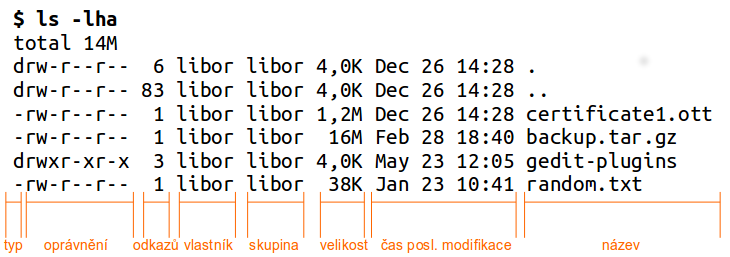

Příkazová řádka
***************

V této kapitole se seznámíme s příkazovou řádkou Linuxu, která je hlavním nástrojem a pracovním
prostředím každého administrátora. Zvládnutí a navyknutí si na příkazovou řádku je nutná podmínka
bez, které nemůžeme Linux efektivně používat a ovládat.

Zcela mylná je představa, že příkazová řádka v době grafických nebo webových rozhraní je něco
překonaného nebo zbytečného. Důvodů, proč je příkazová řádka stále základní nejdůležitější pomocník
správce je mnoho, např.:

* z příkazů můžete vytvořit skript a automatizovat úkoly jako zálohování, kontrola logů ap.
* mnohem rychleji pracujete s klávesnicí, než při přesouvání ruky od myši ke klávesnici a zpátky
* rychlost textového prostředí je mnohonásobně vyšší
* vzdálený přístup z dovolené nebo služební cesty zvládne i nejpomalejší mobilní připojení

.. tip:: Terminál se po chvilce nečinnosti ztmaví. Jakoukoli klávesou jej opět "rozsvítí".

Přihlášení
==========

Po dokončení instalace a restartu se můžeme konečně přihlásit jménem a heslem zvoleným při
instalaci.

.. important::

   Heslo zadávané při přihlašování se *záměrně při psaní nezobrazuje* podobně jako ve většině
   případech v Linuxu, kdy máte napsat heslo. To však nemá vliv na editaci - stále můžete
   používat např. :kbd:`Backspace` ap.

Po přihlášení vás Ubuntu uvítá informací o aktuálním čase, stavu počítače a aktualizovatelných
balíčcích.


Klávesové zkratky
=================

Na tomto místě se musíme zastavit a naučit se symboliku zapisování klávesových zkratek a některých
speciálních kláves.

.. table:: Speciální znaky

   +----------------------+--------------------------------------------------------------------+
   | Klávesa nebo zkratka | Význam                                                             |
   +======================+====================================================================+
   | ``^``                | :kbd:`Ctrl`                                                        |
   +----------------------+--------------------------------------------------------------------+
   | ``^C``               | :kbd:`Ctrl+C`                                                      |
   +----------------------+--------------------------------------------------------------------+
   | ``^C, m``            | stisk :kbd:`Ctrl+C`, uvolnění, vzápětí rychle následované :kbd:`M` |
   +----------------------+--------------------------------------------------------------------+
   | ``M``                | tzv. Meta-klávesa, na dnešních klávesnicích :kbd:`Alt`             |
   +----------------------+--------------------------------------------------------------------+
   | ``M-A``              | :kbd:`Alt+A`                                                       |
   +----------------------+--------------------------------------------------------------------+
   | ``CR``               | klávesa Return, na dnešních klávesnicích :kbd:`Enter`              |
   +----------------------+--------------------------------------------------------------------+
   | ``Super``            | na většině klávesnic odpovídá klávese :kbd:`Win` (s logem Windows) |
   +----------------------+--------------------------------------------------------------------+
   | ``AltGr``            | pravý :kbd:`Alt`                                                   |
   +----------------------+--------------------------------------------------------------------+

Speciální znaky
===============

Na tomto místě se musíme zastavit a naučit se číst speciální znaky na které možná nejste zvyklí, ale
v příkazové řádce Linuxu mají velmi důležitý význam a často se používají.

.. important:: Následující znaky se naučte bezchybně psát, budete je opravdu používat.

.. warning:: Zkratky jako :kbd:`Alt+038` (číslo psané na numblocku) ap. v Linuxu nefungují.

.. table:: Speciální znaky

   +-----------------+--------------------------------------+------------------------------------+-------------------------------------------------------------------+
   | Znak            | Anglický a český název               | Česká linuxová klávesnice          | Častý význam                                                      |
   +=================+======================================+====================================+===================================================================+
   | ``#``           | hash, mřížka                         | :kbd:`AltGr+X`                     | začátek komentáře                                                 |
   +-----------------+--------------------------------------+------------------------------------+-------------------------------------------------------------------+
   | ``~``           | tilda, vlnovka                       | :kbd:`AltGr+Shift+\``              | domovská složka uživatele                                         |
   +-----------------+--------------------------------------+------------------------------------+-------------------------------------------------------------------+
   | ``&``           | ampersand                            | :kbd:`AltGr+C`                     | operátor AND (A SOUČASNĚ) nebo "poslat do pozadí"                 |
   +-----------------+--------------------------------------+------------------------------------+-------------------------------------------------------------------+
   | ``@``           | at-character, zavináč                | :kbd:`AltGr+V`                     |                                                                   |
   +-----------------+--------------------------------------+------------------------------------+-------------------------------------------------------------------+
   | ``^``           | wedge, stříška                       | :kbd:`AltGr+6`                     |                                                                   |
   +-----------------+--------------------------------------+------------------------------------+-------------------------------------------------------------------+
   | ``$``           | dolar                                | :kbd:`AltGr+;` nebo :kbd:`AltGr+4` | proměnné prostředí začínají znakem $                              |
   +-----------------+--------------------------------------+------------------------------------+-------------------------------------------------------------------+
   | ``\``           | backtick, zpětný (obrácený) apostrof | :kbd:`AltGr+\``                    | příkazová uvozovka, řetězec uzavřený v +`+ se provede jako příkaz |
   +-----------------+--------------------------------------+------------------------------------+-------------------------------------------------------------------+
   | ``'``           | single quotes, jednoduché uvozovky   | :kbd:`Alt+'`                       | v řetězci se NErozbalují systémové proměnné                       |
   +-----------------+--------------------------------------+------------------------------------+-------------------------------------------------------------------+
   | ``"``           | double quotes, dvojité uvozovky      | :kbd:`Shift+;`                     | v řetězci se rozbalují systémové proměnné                         |
   +-----------------+--------------------------------------+------------------------------------+-------------------------------------------------------------------+
   | ``|``           | pipe, svislítko                      | :kbd:`AltGr+W`                     | operátor roura propojující STDOUT a STDIN dvou programů           |
   +-----------------+--------------------------------------+------------------------------------+-------------------------------------------------------------------+
   | ``>``           | větší, než                           | :kbd:`AltGr+>`                     |                                                                   |
   +-----------------+--------------------------------------+------------------------------------+-------------------------------------------------------------------+
   | ``<``           | menší, než                           | :kbd:`AltGr+<`                     |                                                                   |
   +-----------------+--------------------------------------+------------------------------------+-------------------------------------------------------------------+


         http://dusan.pc-slany.cz/klavesnice/ceska_klavesnice.htm

.. tip:: Pokud vám česká klávesnice nevyhovuje, můžete si vybrat anglickou nebo jinou příkazem
         ``sudo dpkg-reconfigure keyboard-configuration`` (nutné zadat své heslo).

Bash prompt
===========

V místě blikajícího kurzoru je *prompt* neboli *výzva příkazového řádku*, kde můžeme psát naše
příkazy. Tím úplně prvním, co provedeme je "obarvení" promptu, aby byl přehlednější. Napište
následující text (bez počátečního ``$`` a mezery) a pak odešlete :kbd:`Enter`::

    $ nano .bashrc

.. important: Od této chvíle dál bude cokoli, co máte napsat na prompt, začínat znakem dolar. Ten
   však ale nepíšete - jen reprezentuje, že "zde" je prompt.

Otevřete soubor ``.bashrc`` v textovém editoru nano. Tento soubor je jedním z konfiguračních souborů
*příkazového procesoru Bash* (též *Bash shell*), jak se správně jmenuje prostředí ve kterém od této
chvíle budeme pracovat.

V některých komerčních Unixech nebo BSD můžete narazit i na jiné příkazové procesory jako KSH (Korn
SHell), CSH (C SHell) ap. Těmito poněkud exotickými variantami se nebudeme zabývat, protože BASH je
de facto standardem všech moderních linuxových distribucí.

Přibližně uprostřed souboru ``.bashrc`` najdete zakomentovaný řádek začínající znakem mřížka
(``#``)::

    #force_color_prompt=yes

Odkomentujte řádek (vymažte znak ``#``), stiskněte :kbd:`Ctrl-X` pro odchod z editoru a odpovězte
:kbd:`Y` (Yes) pro uložení změn.

Příkazem ``exit`` se odhlaste, znovu přihlaste a prompt je nyní barevně rozdělen na části např.


kde

* ``joe`` je vaše uživatelské jméno
* ``srv-foo`` název počítače
* ``~`` aktuální pracovní složky (tilda je domovská složka)
* ``$`` indikuje, že odtud můžete psát příkazy

Pohyb a ovládání na promptu
---------------------------

.. rubric:: Šipky nahoru a dolu

Pomocí kurzorových šipek nahoru a dolu se můžete pohybovat v historii použitých příkazů.

.. rubric:: Příkaz history

Příkaz ``history`` vypíše standardně posledních 50 příkazů. V tomto seznamu se tedy pohybujete
šipkami nahoru a dolu.

.. rubric:: Klavesová zkratka :kbd:`Ctrl+C`

Pošle tzv. signál přerušení, který ukončuje aktuální činnost nebo program. Jsou však výjimky, které
na tuto kl. zkratka nereagují a ukončují se nejčastěji např. :kbd:`Q`, příkazem ``bye``,
``exit`` ap.

.. rubric:: Klávesová zkratka :kbd:`Ctrl+D` (EOF)

Znak EOF neboli End of file (konec souboru) se používá v několika málo posledních programech jako
mail nebo at a znamená "ukončuji zadání, teď pracuj ty".

.. rubric:: Klávesová zkratka :kbd:`Ctrl+Z`

Pošle aktuálnímu programu signál k uspání, tedy pozastavení činnosti. Obnovit program můžete
příkazem ``fg`` (foreground, jdi do popředí). Seznam takto zmražených programů zobrazíte příkazem
``jobs``.

.. rubric:: Doplňování na :kbd:`Tab`

Prompt je velmi inteligentní. Napište pár znaků, stiskněte :kbd:`Tab`, a Bash zkusí doplnit název
souboru, složky, programu, a u některých programů dokonce i parametry programu.

.. rubric:: Klávesové zkratky :kbd:`Ctrl+Alt+F1` až :kbd:`Ctrl+Alt+F7`

Standardně můžeme pracovat až v 7 terminálech současně a mezi nimi pomocí těchto zkratek přepínat.
1. až. 6. jsou vždy textové. 7. terminál je GUI, je-li nainstalováno, nebo startovací obrazovka v
případě textového systému.

Parametry programů a příkazů
============================

Než se naučíme několik základních programů a příkazů bez kterých se nedá obejít, bude užitečné se
seznámit se symbolickým zápisem parametrů. Naučíte se tak správně číst jaké parametry program
nabízí, jak se dají kombinovat, které jsou volitelné atp.

Mezi názvem programu a parametry ovlivňující jeho chování musí být vždy mezera. Třeba předchozí
příkaz ``nano .bashrc`` je volání textového editoru nano s parametrem ``.bashrc``.

V manuálových stránkách a dokumentaci programů narazíte na ustálený symbolický zápis parametrů ze
kterých vyčteme přesný způsob použití.

.. note:: Jako "prefix parametrů" se obvykle nikdy nepoužívá ``/`` (např. ``/h``), ale vždy ``-``
   (např. ``-h``) nebo nic. V Linuxu ``/`` znamená oddělovač složek v cestě.

Podívejme se na několik příkladů:

.. rubric:: ``man [-C file]``
	
Volitelný parametr ``-C``, který musíte společně uvést s názvem souboru místo ``file``.

.. rubric:: ``find [path...]``

Libovolně opakovatelný a současně volitelný parametr ``path``.

.. rubric:: ``apropos [-e|-w|-r]``

Logická podmínka NEBO je symbolizována svislítkem. Můžete si vybrat buď jen ``-e``, ``-w``, ``-r``,
nebo žádný, protože celá skupina parametrů je volitelná.

.. rubric:: ``-l, --long``

Zkrácený a dlouhý název parametru. Můžete si vybrat podobu, kterou si pamatujete nebo vám vyhovuje.
Je identické ``ls -l`` a ``ls --long``.

.. _man-help:

Manuálové stránky a nápověda
============================

Je pevným pravidlem, že každý program má i svojí manuálovou stránku, kde najdete kompletní
dokumentaci použití, parametrů a konfigurace.

.. rubric:: Zobrazení manuálové stránky -- man

Zobrazení man stránky je velmi jednoduché::

    man [kapitola] <program | soubor>
	
např. ``man nano``. Kapitola se většinou neuvádí.

.. todo:: odkaz na less

Prohlížečem manuálu je ve skutečnosti program less, proto si nyní jen řekneme, že prohlížeč less

* ukončíte stiskem :kbd:`Q`
* vyhledáváte na stránce stiskem :kbd:`/`, a zapsáním výrazu do stavové řádky a :kbd:`Enter`.
* mezi výsledky hledání s posouváte :kbd:`n` pro vpřed a :kbd:`N` pro zpět.

.. tip:: Manuálové stránky mají dokonce i konfigurační soubory. Zajímá vás jakou syntaxi má např.
   soubor ``/etc/fstab``? Napište ``man fstab``.

.. rubric:: Vyhledávání v manuálových stránkách -- apropos

Nemůžete si vzpomenou, jak se některý program jmenuje? Program apropos umí vyhledat zadaný výraz
(resp. regulární výraz) v názvech a popisu man stránek. Např.::

	apropos passwd

najde všechny výskyty slova "find" v man stránkách a samozřejmě najde i nápovědu pro program
jmenující se find::

	chgpasswd (8)        - update group passwords in batch mode
	chpasswd (8)         - update passwords in batch mode
	Crypt::PasswdMD5 (3pm) - Provides interoperable MD5-based crypt() functions
	fgetpwent_r (3)      - get passwd file entry reentrantly
	getpwent_r (3)       - get passwd file entry reentrantly
	gpasswd (1)          - administer /etc/group and /etc/gshadow
	grub-mkpasswd-pbkdf2 (1) - generate hashed password for GRUB
	lppasswd (1)         - add, change, or delete digest passwords.
	mkpasswd (1)         - Overfeatured front end to crypt(3)
	pam_localuser (8)    - require users to be listed in /etc/passwd
	passwd (1)           - change user password <1>
	passwd (1ssl)        - compute password hashes
	passwd (5)           - the password file <1>
	passwd2des (3)       - RFS password encryption
	smbpasswd (5)        - The Samba encrypted password file
	smbpasswd (8)        - change a user's SMB password
	SSL_CTX_set_default_passwd_cb (3ssl) - set passwd callback for encrypted PEM ...
	SSL_CTX_set_default_passwd_cb_userdata (3ssl) - set passwd callback for encry...
	update-passwd (8)    - safely update /etc/passwd, /etc/shadow and /etc/group

Všimněte si čísla v závorce za názvem stránky - např. ``passwd (1)`` a ``passwd (5)``. Manuálové
stránky jsou členěny na kapitoly a proto někdy může být stejná stránka v různých kapitolách. Seznam
kapitol najdete na ``man man``.

Chcete-li tedy např. zjistit informace o příkazu passwd z kapitoly 1, použijete ``man passwd`` nebo
``man 1 passwd``. Naopak o stejně pojmenovaném konfiguračním souboru se dozvíte z ``man 5 passwd``.

.. rubric:: Nápověda pro příkazy -- help

Někté programy jsou ve skutečnosti *zabudované příkazy (builtin commands)* Bashe. Patří mezi ně ty
nejzákladější, jako ``cd``, ``exit``, ``fg``, ``jobs``, ``echo``, ``set`` ap. Pro ně neexistuje
manuálová stránka, ale trochu jednodušší systém nápovědy ``help``::

	help <zabudovaný-příkaz>
	
např. ``help cd`` apod.

.. tip:: Není potřeba vědět, co je program a co příkaz. Zapamatujte si zkrátka, že pokud
   ``man <něco>`` neexistuje, zkuste ``help <něco>``.

.. tip:: Pro zvědavé existuje zabudovaný příkaz ``type``, který poví, zda je parametr program,
   příkaz nebo alias. Zkuste si např. ``type echo`` nebo ``type nano``.

.. todo:: odkaz na aliasy

Příhlášení, odhlášení
=====================

.. rubric:: exit

Příkaz exit už znáte. Ukončí vaše běžící programy a odhlásí vás.

.. rubric:: logout

Logout je podobný, ale neumožní vás odhlásit, běží-li na pozadí nějaké programy.

.. todo:: Ctrl-D taky odhlásí

Vypnutí a restart PC
====================

.. rubric:: sudo shutdown -h now

Příkaz shutdown vypíná nebo restartuje PC. Protože tato operace by ovlivnila jiné přihlášené
uživatele a může ji provést jen administrátor, musíme celý program předat jako parametr programu
sudo.

.. todo:: odkaz na sudo výše

.. rubric:: sudo reboot

Provede restart.

.. todo:: taky halt, ale není ve <<vypnutiPC>>??

.. note:: Detailní informace o tomto tématu najdete v :ref:`vypnutiPC`.

Zobrazení a editace souborů
===========================

Editory nano a vim
------------------

.. rubric:: nano

Pravděpodobně nejjednodušším editorem pro textové prostředí je nano. Jeho název je narážkou na
předchůdce program pico. Najdete ho v každé instalaci Ubuntu nastavený jako výchozí editor.


Ovládání:

* uložení – :kbd:`Ctrl+O`
* hledání – :kbd:`Ctrl+W`, zadejte výraz, opakujte :kbd:`Ctrl+W` pro další výskyty
* ukončení – :kbd:`Ctrl+X`, budete vyzváni k uložení, odpovězte :kbd:`y` pro ano, :kbd:`n` pro ne
* jednorázové zobrazení čísla řádku/sloupce – :kbd:`Alt+C`

Důležité parametry:

* ``-c`` – zobrazit číslo řádku a sloupce v zápatí obrazovky, zobrazit číslo řádku na začátku nano
  neumí
* ``-$`` – zalamovat dlouhé řádky (wrap). Protože $ znamená proměnnou shellu, **musíme parametr 
uvést vždy jako poslední!**

.. rubric:: vim a emacs

Mezi další tradiční editory v Linuxu a Unixu patří vim (vi iMproved) a emacs, ale jejich ovládání rozhodně není ani snadné, ani intuitivní. 

Zájemce o Emacs odkazujeme internet.

Vim někdy bývá výchozím editorem, proto si řekneme alespoň, jak se vim ukončí. Pustíte-li vim
např. ``vim .bashrc``, ukončíte ho :kbd:`:`, :kbd:`x`, a :kbd:`Enter`.

Prohlížeč cat a less
--------------------

.. rubric:: cat

Cat je jedním z nejprostších programů vůbec. Umí jen vypsat obsah souboru a skončit::

	cat <soubor>
	
např. ``cat /etc/hostname`` vypíše název počítače v tomto souboru.

Užitečnou volbou může být ``-n, --number`` zobrazující u vypisovaných řádků jejich číslo::

	$ cat -n /etc/hostname
	1	srv-foo

.. rubric:: less

Prohlížeč neboli pager less (méně) je opět slovní hříčkou na starší program more (více). Kdykoli
použijete :ref:`man stránky <man-help>` čtete si je v programu less. Vyplatí se proto, naučit se, 
less, výborně ovládat.

Příklad použití::

	less [parametry] <cesta/k/souboru>
	
Ovládání:

* zalamovat dlouhé řádky – :kbd:`-`, :kbd:`Shift+S`, :kbd:`Enter`
* vyhledávání a skok na první výskyt – :kbd:`/`, hledaný výraz, :kbd:`Enter`
* další výskyt hledaného textu – :kbd:`n`
* předchozí výskyt hledaného textu – :kbd:`N`
* skok na konec souboru – :kbd:`Shift+G`

Důležité parametry:

* ``-N, --LINE-NUMBERS`` – zobrazení čísla řádku
* ``–S, --chop-long-lines`` – nezalamovat dlouhé řádky (protože defaultně zalamuje)

.. _head-tail:

Začátky a konce -- head a tail
------------------------------

Program head zobrazí standardně prvních 10 řádků souboru, tail posledních 10. 

Porovnejte výstupy::

	$ head .bashrc
	$ tail .bashrc

Tail má velmi užitečný parametr, který se vyplatí si zapamatovat a to ``-f``, kdy tail neskončí a
zobrazuje "ocásek" souboru, tak jak v něm postupně přibývají řádky. Tento parametr je velmi často
používaný např. pro "živé" sledování nových záznamů v log souboru ap.

.. _tail-f-priklad:

Vyzkoušejte si zajímavý příklad na ``tail -f``:

#. Na prvním terminálu spusťte ``strings /dev/urandom > ~/random.txt``
#. Chvilku nechte běžet
#. Přepněte se např. na druhý terminál (:kbd:`Ctrl+Alt+F2`) a napište ``tail -f ~/random.txt``
#. Střídejte po chvilkách první a druhý terminál.

Zatím jsme nevysvětlili znaky jako ``>``, ``~`` nebo co je ``/dev/random``, ale z příkladu sami
jistě odtušíte, že první příkaz zapisuje náhodné znaky do souboru ``random.txt``.

Vyčištění obrazovky - reset a clear
===================================

.. rubric:: clear

Clear je obdoba ``cls`` z MS-DOSu a smaže obsah obrazovky.

.. rubric:: reset

"Drsnější" clear, který kompletně resetuje obrazovku. Vhodné, když se vám terminál tzv.
"zbláznil" a místo znaků zobrazuje "kliky-háky".


Pohyb na disku -- cd, pwd, ls
=============================

.. rubric:: cd

Příkaz cd (*change directory*) asi nebude nutné příliš představovat. Jeho funkcí je změnit
aktuální *pracovní složku (working directory)*.

Pro skok do nadřazeného adresáře slouží ``cd`` *mezera* a dvě tečky::

	$ cd ..

.. warning:: Začátečníci často zkouší ``cd..`` (bez mezery před ``..``). To skončí chybou
   ``neexistující program cd..``.

Nezáleží na tom, jestli je cesta :ref:`relativní nebo absolutní <relativni-absolutni-cesta>`::

	$ cd /home/joe
	$ cd ../../var/local
	$ cd /etc/init.d/

.. tip:: ``cd -`` skočí do předcházejícího adresáře.

.. rubric:: pwd

Pokud není prompt nakonfigurován zobrazovat aktuální složku jako v Ubuntu, můžete použít příkaz
pwd neboli *print working directory*.::

    $ pwd
	/home/joe/


.. rubric:: ls

Program ls (*list*) vypisuje soubory a podadresáře aktuální nebo zadané složky. Stejný příkaz v
MS-DOSu byl ``dir``, možnosti ls jsou však mnohem větší.

Bez parametrů vypíše ls abecedně seřazený obsah ve sloupcích.

Vyzkoušejte a zapamatujte si následující tři klíčové parametry ls:

* ``-l, --long`` -- dlouhý výpis neboli do tabulky se sloupci oprávnění, vlastník, skupina,
   velikost a samozřejmě název
* ``-a, --all`` -- zobrazení i :ref:`skrytých souborů (tečkových souborů, dot-files) <skryte-soubory>`
* ``-h, --human-readable`` -- velikost souboru v násobcích bajtů (např. 1K, 234M, 2G ap.)

Na ls je vhodné se naučit se kombinovat parametry. Např. parametr ``-h`` má smysl jen s ``-l``, kdy
je zobrazována velikost::

	$ ls -lh

Na pořadí parametrů většinou nezáleží (musíte ale posoudit význam parametrů vždy případ od případu).
Pokud chcete zobrazit dlouhý výpis, skryté soubory a "lidské velikosti" budou následující příkazy
stejné::

	$ ls -lha
	$ ls -lah
	$ ls -hal
	$ ls -hla
	$ ls -alh
	$ ls -ahl
	
.. todo:: také ls -l -h -a ap.



.. topic:: Binární předpony

   Jednotky, které ls používá při volbě ``-h`` nejsou kB, MB, GB ap.! Prefixy k, M, G jsou násobky
   tisíců, kdežto v IT se tradičně používají násobky 1024. Správné označování násobků 1024 je kiB,
   MiB, GiB ap., které se čtou [kilobí], [megabí], [gigabí] ap. Těmto předponám se říká
   `binární předpony <https://cs.wikipedia.org/wiki/Bin%C3%A1rn%C3%AD_p%C5%99edpona>`_. Pokud
   výslovně potřebujete násobky 1000 (SI násobky), použijte parametr ``--si``.

Vyhledávání - grep
==================

Posledním elementárním programem pro běžnou práci je grep, který umí vyhledávat v obsahu buď
standardního vstupu (STDIN) nebo v obsahu souborů.

.. note:: Vysvětlit grep bez znalostí přesměrování a rour popisovaných v sekci o
   :ref:`přesměrování <presmerovani>` je velmi obtížné. Proto si text zde přečtete, ale
   vraťte se k němu po prostudování mechanismu přesměrování.

.. rubric:: Hledání v STDIN

Použití bude pro nás až do následující kapitoly trochu záhadné::

	<příkaz> | grep <hledaný-výraz>
	
znamená, že se výstup STDOUT příkazu pošle (znak roura ``|``) do vstupu STDIN programu grep, který
vypíše jen řádky vyhovující hledanému výrazu. Např.::

	cat /etc/passwd | grep root
	
vypíše řádky v ``/etc/passwd`` souboru obsahující slovo ``root``.

.. rubric:: Hledání v obsahu souborů -- ``grep -r``

Druhé použití grep je pro hledání v obsahu souborů::

	$ grep -r <výraz>

.. _grep-i:

.. rubric:: Hledání bez ohledu na velikost písmen -- parametr ``grep -i``

Obě předchozí funkce jsou skvělé, ale často nám nezáleží na velikosti písmen hledaného výrazu
(hledanýVýraz, HledanýVýraz, HLEDANÝVÝRAZ, nebo další kombinace). Parametr ``-i, --ignore-case``
vypíná citlovost na velikost písmen::

	$ <příkaz> | grep -i <výraz>
	$ grep -ri <výraz>

.. _presmerovani:

Přesměrování vstupu a výstupu
=============================

Každý program žije zcela izolovaně od ostatních programů ve svém vlastním paměťovém prostoru.
Jedinou možností spolupráce (výměny dat) mezi programy je používat zařízení jako je síťová karta,
soubory ap. Programy mají však k dispozici ještě tzv. standardní vstup a dva standardní výstupy.
Tyto komunikační vstupy/výstupy (V/V, nebo anglicky input/output (I/O)) jako uživatel snadno
přesměrujeme jinam nebo navzájem propojíme.

* **standardní vstup (stdin nebo STDIN)** -- na STDIN je standardně připojena klávesnice. STDIN
  můžeme přesměrovat např. na soubor a tak "simulovat" stisky z klávesnice.
* **standardní výstup (stdout nebo STDOUT)** -- první ze dvou výstupů je "běžný" výstup určený pro
  ne-chybové hlášky, informace ap. Standardně je STDOUT posílán na obrazovku.
* **standardní chybový výstup (stderr nebo STDERR)** -- druhý chybový výstup by měl být určen jen
  pro reportování chybových hlášek. Standardně je STDERR taktéž posílán na obrazovku.

Nejčastěji přesměrováváme standardní V/V mezi souborem a obrazovkou, ale vzhledem k faktu, že v
Linuxu je vše soubor, můžeme přesměrování provést na/z sériového portu, pevného disku ap.

.. todo:: Odkaz z "vše je soubor" na kap. 02 "soubory zařízeních" USRV2.

Operátory
---------

Pro ovlivnění standardních V/V slouží tzv. operátory přesměrování. Následující tabulka uvádí ty
nejpoužívanější.

.. table:: Nejdůležitější operátory přesměrování

   +------------------------+-----------------------+--------------------------------------------------------------------+
   | Operátor               | Směr                  | Funkce                                                             |
   +========================+=======================+====================================================================+
   | ``>`` nebo ``1>``      | STDOUT → soubor       | Přesměrování STDOUT a vytvoření/přepsání existujícího souboru      |
   +------------------------+-----------------------+--------------------------------------------------------------------+
   | ``>>``                 | STDOUT → soubor       | Přesměrování STDOUT a vytvoření/připojení na konec souboru         |
   +------------------------+-----------------------+--------------------------------------------------------------------+
   | ``<``                  | soubor → STDIN        | Přesměrování STDIN z klávesnice na soubor                          |
   +------------------------+-----------------------+--------------------------------------------------------------------+
   | ``2>``                 | STDERR → soubor       | Přesměrování STDERR do souboru                                     |
   +------------------------+-----------------------+--------------------------------------------------------------------+
   | ``2>&1`` nebo ``&>``   | STDERR → STDOUT       | Přesměrování STDERR na STDOUT                                      |
   +------------------------+-----------------------+--------------------------------------------------------------------+
   | ``1>&2``               | STDOUT → STDERR       | Přesměrování STDOUT na STDERR                                      |
   +------------------------+-----------------------+--------------------------------------------------------------------+
   | ``|``                  | STDOUT → STDIN        | Přesměrování STDOUT na STDIN následujícího programu                |
   +------------------------+-----------------------+--------------------------------------------------------------------+
   | ``2>&1 |``             | STDOUT+STDERR → STDIN | Spojí STDOUT a STDERR a přesměruje na STDIN následujícího programu |
   +------------------------+-----------------------+--------------------------------------------------------------------+

Příklady na přesměrování
------------------------

.. rubric:: Přesměrovat, přepsat

Přesměrování jsme již viděli ve :ref:`starším příkladu <tail-f-priklad>`, který nyní dovedeme
vysvětlit::

	$ strings /dev/urandom > random.txt

Program strings je vhodný hlavně pro vývojáře. Hledá v binárních souborech tisknutelné znaky.
Speciální soubor zařízení (device file) ``/dev/urandom`` obsahující nekonečně dlouhou sekvenci
náhodných čísel je takto filtrován jen na tisknutelné znaky. Výstup STDOUT, jinak směřující na
obrazovku, je přesměrován operátorem ``>`` do souboru ``random.txt``.

.. todo:: Odkaz na device file z USRV2.

.. rubric:: Připojit, nepřepsat

Změnou z ``>`` na ``>>`` dosáhneme, že je obsah k souboru připojen (append), nikoli přepsán::

	$ cat /dev/random >> random.txt

.. rubric:: Přesměrování STDERR

Přesměrovat pouze chybový výstup můžeme s ``2>``::

	$ grep -blah 2> stderr.txt
	$ cat stderr.txt
	Usage: grep [OPTION]... PATTERN [FILE]...
	Try 'grep --help' for more information.

.. rubric:: Spojení STDERR a STDOUT

Často chceme uchovat běžný výstup i ten chybový v jediném souboru. Tradiční a trochu
krkolomné vyjádření je s ``2>&1``. Nejprve přesměrujeme STDOUT programu do souboru a na závěr
STDERR programu napojíme na STDOUT, který byl již přesměrován do souboru::

	$ program > vystup.log 2>&1

Jiným a přehlednějším způsobem, jak spojit STDERR a STDOUT a přesměrovat do souboru je ``&>``::

	$ program &> vystup.log

.. rubric:: Roura

Roura neboli znak ``|`` (svislítko, pipe) kombinuje předchozí operátory přesměrování STDIN ``<`` a
STDOUT ``>``. Spojuje STDOUT na STDOUT následujícího programu napřímo bez nutnosti použití souboru
jako "mezičlánku".

Tento druh přesměrování jsme také již viděli použitý v ukázce na :ref:`grep -i <grep-i>`, kdy jsme
propojili STDOUT příkazu (běžně napojený na obrazovku) na STDIN grepu (běžně napojený na
klávesnici)::

	$ <příkaz> | grep -i <výraz>

Musíme držet na paměti, že roura spojuje STDOUT na STDIN následujícího programu. **Výstup na STDERR
prvního programu do roury nevstupuje**.

Program ls můžeme požádat o výpis více souborů/složek zadaných jako parametry - např. ``/home/`` a
``/var/``, ale u druhé složky uděláme překlep v názvu. Ls vypíše obsah první složky na STDOUT, ale
druhá neexistuje a chybu vypíše na STDERR. Např. cat napojený na rouru proto nikdy chybu neobdrží a
čísluje jen získaný STDOUT::

	$ ls /home/ /war/ | cat -n
	ls: cannot access /war: No such file or directory
     1	/home:
     2	jell
     3	lost+found

Aby jsme do roury poslali STDOUT i STDERR, musíme použít další operátor přesměrování spojující tyto
dva proudy::

	$ ls /home /war/ 2>&1 | cat -n
     1	ls: cannot access /war/: No such file or directory
     2	/home:
     3	jell
     4	lost+found

.. rubric:: Kombinace operátorů

Operátory (nejčastěji rouru) na sebe můžeme vzájemně napojovat. Např.::

	$ apropos find | grep -i path | cat -n
	1	glob (3)             - find pathnames matching a pattern, free memory from gl...
	2	globfree (3)         - find pathnames matching a pattern, free memory from gl...
	3	XtFindFile (3)       - search for a file using substitutions in the path list

Apropos vyhledá "find" v manuálových stránkách. Výstup je poslán grepu, který vyfiltruje jen řádky
se slovem "path". I jeho výstup je předán cat číslující řádky.

Proměnné prostředí
==================

Jak jsme již několikrát zmínili, Bash je ve skutečnosti docela propracovaný programovací jazyk. Pro
běžnou práci na příkazové řádce Bashe to skoro nepoznáme, kromě proměnných prostředí, která se 
podobají proměnným v běžných programovacích jazycích.

*Proměnná prostředí (environment variable)* umožňují na číselnou nebo textovou hodnotu odkazovat
jménem proměnné. Přítomnost nebo hodnota proměnné také může sloužit ke konfiguraci programu podobně,
jako parametry.

.. rubric:: Nastavení a zrušení

Proměnnou nastavíte jednoduše::

	$ jmeno=Joe
	$ vek=29

Proměnné začínají ``$`` a rozbalují se (expandují se) na hodnoty a můžete vytvářet kombinace jako::

	$ dohromady="$jmeno je $vek let stary"

Alternativní syntaxe ``${<proměnná>}`` je vhodná, když by měl Bash problém rozlišit, kde začíná nebo
končí název proměnné. Kdybychom chtěli vypsat "Joe je 29letý", nemůžeme napsat

::

	$ dohromady="$jmeno je $vekletý"
	
protože Bash bude hledat neexistující proměnnou ``$vekletý``. Správně tedy bude::

	$ dohromady="$jmeno je ${vek}letý"
	
Aby proměnnou prostředí viděl nejen interpret Bash sám, ale i programy interpretem spuštěné, musíme
proměnnou exportovat::

	# Dříve vytvořená proměnná
	$ export dohromady
	
	# Vytvoření a export v jednom kroku
	$ export mesto=Praha
	
Jestli proměnná nebude již potřeba, pak můžeme jen nastavit "prázdnou" hodnotu nebo ji úplně zrušit
(nebude již ve výpisu proměnných :ref:`env <env>`)::

	$ mesto=
	$ unset mesto

.. rubric:: Vypsání
	
Hodnotu můžeme vypsat příkazem ``echo``::

	$ echo $dohromady
	Joe je 29 let stary

.. _env:

Nebo vypsat všechny pomocí ``env`` (výstup bývá na několik obrazovek proto ještě less)::

	$ env | less

.. rubric:: Nejdůležitější proměnné prostředí

* ``HOME`` -- Absolutní cesta k domovské složce aktuálního uživatele. Např. ``/home/jekyll``.
* ``USER`` -- Uživatelské jméno aktuálního uživatele. Např. ``jekyll``.
* ``HOSTNAME`` -- Jméno počítače. Např. ``nb-jekyll``.
* ``PATH`` -- Vyhledávací cesta (viz dále).

.. rubric:: Vyhledávací cesta PATH

Proměnná ``PATH`` neboli *vyhledávací cesta* je seznam složek, kde bude Bash hledat programy.
Pokud program v žádné složce tohoto seznamu nenajde, uvidíte ``<program>: command not found``.

V čerstvé instalaci Ubuntu bude ``PATH`` obsahovat přibližně tyto dvojtečkou oddělené složky::

  $ echo $PATH
  /usr/local/sbin:/usr/local/bin:/usr/sbin:/usr/bin:/sbin:/bin:/usr/games:/usr/local/games

Všimněte si, že ``PATH`` neobsahuje aktuální složku (``.``), tj. i když je v aktuální složce
spouštěný program, musíte se na něj explicitně odkázat ``./<program>``::

  $ ls
  program-raz-dva   soubor.txt   ...
  $ program-raz-dva
  program-raz-dva: command not found
  $ ./program-raz-dva
  #program-raz-dva spuštěn

Výchozí cesta je nastavena startovacími skripty během bootu OS. Můžete ji ale kdykoli později
modifikovat. Přidání na konec ``PATH``:

	$ PATH=$PATH:/moje/cesta

nebo na začátek::

	$ PATH=/moje/cesta:$PATH
	
Nyní tedy víme, proč spustíme program nano odkudkoli na disku. Ve které složce ve vyhledávací
cestě se však nachází, zjistíme pomocí ``which`` (který)::

	$ which nano
	/usr/bin/nano

Tři druhy uvozovek
==================

Viděli jsme, jak dochází k expanzi proměnných prostředí na jejich hodnoty. To však platí jen při
neuvedení uvozovek nebo při dvojitých uvozovkách.

* ``"`` (dvojité uvozovky) --- Řetězec mezi dvojitými uvozovkami se prohledává na proměnné, které se
  rozbalí na hodnotu.
* ``'`` (jednoduché uvozovky) -- Řetězec mezi jednoduchými uvozovkami je interpretován tak, jak
  je - tzn. nedochází k expanzi proměnných a ignorují se speciální znaky jako ``\n``, ``\t`` ap.
* ``\``` (obrácený apostrof) -- Řetězec mezi obrácenými apostrofy se provede jako příkaz. Jeho
  výstup se stane výslednou hodnotou řetězce.

Neuvést uvozovky nebo uvést dvojité je stejné. Následující zápisy mají tedy stejný efekt::

	$ echo $PATH
	$ echo "$PATH"

Předchozí příklady napsané v jednoduchých uvozovkách tedy nevypíší hodnotu proměnné, ale
vytisknou se tak, jak jsou::

	$ echo '$PATH'
	$PATH
	
Obrácené apostrofy jsou velmi zajímavou funkcí Bashe. Např. pro vypsání dnešního data můžete
použít::

	$  echo Ahoj $USER! Dnes je `date`.
	Ahoj lisa! Dnes je St dub 30 13:51:40 CEST 2014.

Tilda ~
=======

Tildu bychom mohli zařadit mezi proměnnou prostředí. Chová se jako proměnná i když jí technicky 
není. Její hodnotou je absolutní cesta k domovskému adresáři. Proto jsou následující příkazy 
identické::

	$ cd $HOME
	$ cd ~
	
Stejně jako tato dvojice::

	$ cp /var/log/kern.log $HOME/tmp/
	$ cp /var/log/kern.log ~/tmp/

Obrácené lomítko \ (backslash)
==============================

Znak \ (obrácené lomítko) mívá tři odlišné významy, které se musíme naučit.

.. important:: Obrácené lomítko (\) nikdy neslouží jako oddělovač cesty, kterým je v Linuxu vždy
   běžné lomítko (/) (forward slash).

.. rubric:: Řídící nebo formátovací znaky

Kdykoli chcete vypsat třeba znak "tabelátor" nebo "nový řádek" použijte ``\t``, resp. ``\n``::

  $ echo -e "ahoj\tjak\nse\tmas"
  ahoj		jak
  se		  mas

Další méně používané řídící znaky najdete např. v manuálové stránce programu echo (``man echo``).

.. rubric:: Pokračování příkazu na další řádce

Velmi dlouhé příkazy na příkazové řádce nebo skriptu můžeme pro přehlednost rozdělit na více řádků
pomocí ``\``::

	$ echo \
		velmi dlouhý \
		příkaz \
		na více řádků
	velmi dlouhý příkaz na více řádků

.. rubric:: Neinterpretovat znak

Některé znaky, jako např. právě zpětné lomítko, mají speciální význam pro vyhledávání (žolíky) nebo
proměnné prostředí ($). Když ale opravdu chceme jen vypsat znaky jako \ nebo $ musíme je tzv.
*escapovat* (napsat *escape sekvenci*) přidáním \ před znak::

	$ echo Znaky se speciálním významem jsou např. \~, \\, \$
  Znaky se speciálním významem jsou např. ~, \, $

Žolíky (wildcards)
==================

Poslední základní dovedností jsou tzv. *žolíky (wildcards, též globbing patterns)* umožňující
postihnout skupinu souborů nebo složek vyhovující určitému pravidlu.

.. table:: Nejdůležitější žolíky v Bashi

   +----------------+----------------------------------------+-----------------------------------------------------------------------------------------------------------------------------------------------------------------------------------------------------+
   | Znaky          | Popis                                  | Příklad                                                                                                                                                                                             |
   +================+========================================+=====================================================================================================================================================================================================+
   | ``*``          | jakýkoli počet znaků (včetně žádného)  | Jinými slovy nula nebo znaků. Pro "f*d" bude vyhovovat "find", "fond", ale i jen "fd"                                                                                                               |
   +----------------+----------------------------------------+-----------------------------------------------------------------------------------------------------------------------------------------------------------------------------------------------------+
   | ``?``          | jakýkoli *jeden* znak                  | Pro "f?nd" bude vyhovovat "find", "fInd", "fond", ap.                                                                                                                                               |
   +----------------+----------------------------------------+-----------------------------------------------------------------------------------------------------------------------------------------------------------------------------------------------------+
   | ``[]``         | rozsah                                 | Pro "hd[a-e]" bude vyhovovat "hda", "hdb", "hdc", a "hde".                                                                                                                                          |
   +----------------+----------------------------------------+-----------------------------------------------------------------------------------------------------------------------------------------------------------------------------------------------------+
   | ``[!]``        | vyloučit z rozsahu                     | Podobné jako [], ale slouží k vyloučení znaků v hranatých závorkách z vyhledávání. Pro "mujsoubor[!9]" bude vyhovat "mujsoubor1", "mujsoubor2", "mujsoubor3" atd., ale nebude vyhovat "mujsoubor9". |
   +----------------+----------------------------------------+-----------------------------------------------------------------------------------------------------------------------------------------------------------------------------------------------------+
   | ``{}``         | výčet                                  | Pro "{mama,tata}" bude vyhovat "mama" nebo "tata".                                                                                                                                                  |
   +----------------+----------------------------------------+-----------------------------------------------------------------------------------------------------------------------------------------------------------------------------------------------------+
   | ``\``          | escape znak                            | Chceme-li hledat znak \, musíme ho "ochránit" zdvojením na \\.                                                                                                                                      |
   +----------------+----------------------------------------+-----------------------------------------------------------------------------------------------------------------------------------------------------------------------------------------------------+

.. Zdroj http://www.tldp.org/LDP/GNU-Linux-Tools-Summary/html/x11655.htm
   Ještě bohatší možnosti v Bashi na http://mylinuxbook.com/8-examples-of-wildcards-in-bash/


Např. vypsat všechny soubory a složky začínající textem "pa" ve složce ``/etc/``::

	$ ls /etc/pa*

Žolíky lze opakovat::

	$ ls /dev/sd[a-z][0-9]

Rovněž lze žolíky kombinovat. Třeba, pokud chcete smazat všechny jpg, png a pdf soubory::

	$ rm {*.jpg,*.png,*.doc}
