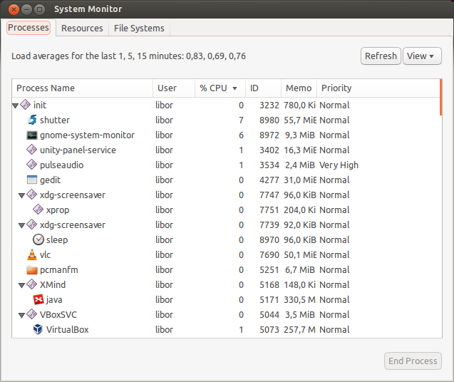

Procesy a démoni
****************

V této závěrečné kapitole kurzu Ubuntu a Debian Linuxu se naučíme trochu symbolicky počítač vypnout.
Dále prozkoumáme procesy a jak se spravují. Posledním tématem budou démoni, neboli procesy běžící na
pozadí, kteří plní nějakou službu.

.. _vypnutiPC:

Ukončení práce s PC
===================

.. note:: Vypnout nebo restartovat PC může v textovém prostředí jen superuživatel. Je to z důvodu,
   že Linux/Unix je od prvopočátku víceuživatelský systém a taková operace samozřejmě ovlivní i
   ostatní právě přihlášené uživatele.

Ubuntu nabízí více možnosti, jak ukončit práci s počítačem.

shutdown
--------

Program shutdown připraví systém na bezpečné vypnutí nebo restart.

::

	shutdown (-r | -h) <čas> [zpráva]

Všichni přihlášení uživatelé mohou obdržet na obrazovku hlášku *zpráva* (je-li uvedena) o chystaném
vypnutí (``-h``) nebo restartu (``-r``) a 5 minut před *čas* je zabráněno novým přihlášením.

Čas je možné specifikovat jako

* konkrétní údaj *HH:MM*
* formou "od teď za N minut" pomocí výrazu ``+N``, kde N je počet minut
* nebo nejčastěji "teď hned" slovem ``now``

Příklady::

	$ sudo shutdown 19:30 "Vážení uživatelé, restart v 19:30"
	$ sudo shutdown -r +5 "Vážené uživatelé, restart za 5 minut"
	$ sudo shutdown now

.. note:: Volba `-h` zastaví OS a *pokusí se* vypnout napájení. Ve výjimečných případech, kdy není
   podporována správa napájení (většinou jen prehistorické PC), musíte fyzické vypnutí od elektrické
   energie provést sami.

reboot
------

Provede stejnou operaci jako ``shutdown -r now``, ale je zapotřebí méně písmenek :-)

halt
----

Provede zastavení OS - nevypíná napájení počítače. Narozdíl do `shudown -h` skutečně jen zastaví běh
Linuxu. Využití v praxi neznáme.

poweroff
--------

Provede stejnou operaci jako ``shutdown -h now``, ale s méně písmenky :-)

.. Kvíz:
   Q: Využitím jaké dříve popisované vlastnosti byste vysvětlili, že v CLI může vypnutí nebo restart provést jen root, ale v GUI kdokoli?
   A: Program na vypnutí v GUI má SUID/GUID bit.

Procesy
=======

*Proces* je právě běžící program. Spustíte-li vy, jádro nebo jiný proces program, založí se nový
proces.

Každý proces běží izolovaně od ostatních. Má vyhrazen vlastní paměťový prostor a čas procesoru.
Komunikovat mezi procesy nebo uživatelem a procesy může probíhat jen pomocí V/V prostředků (disk,
soubor, síť), :ref:`standardních V/V <presmerovani>` (STDIN, STDOUT, STDERR), nebo tzv.
:ref:`signálů <signaly>`.

Někdy je proces třeba pozastavit, ukončit nebo změnit prioritu procesu. Jako superuživatel můžete
takto řídit procesy kohokoli, uživatelé mohou jen své vlastní.

Identifikace procesu
--------------------

Mezi desítkami či stovkami procesů je třeba se nějak orientovat.

.. rubric:: PID

Jádro i správce každý proces identifikují pomocí jednoznačného *PID (process ID)*. Většina dále
popisovaných programů pro řízení procesů požaduje právě PID jako argument.

.. rubric:: PPID

Pouze již existující proces může vytvořit nový proces, tj. podproces. Rodič tohoto podprocesu je
označen jako *PPID (parent PID)*. Když hledáte, kdo vytváří "zblázněné" procesy, stačí se podívat na
jejich PPID hodnotu a hned znáte viníka.

.. rubric:: UID a EUID

UID (User ID) majitele (kdo proces spustil) a efektivní UID.

Sledování procesů
=================

ps -- základní sledování
------------------------

Tradičním programem pro sledování (výpis) procesů je ps. Velkou většinu jeho parametrů nebudeme
nikdy potřebovat.

.. note:: ps je ukázkou dokonce tzv. "trisexuálního" chování. Možná si pamatujete, že např. find
   poskytoval BSD a GNU syntaxi. Protože ps byl programem používaným od prvopočátku a každý \*nix
   systém si ho trochu přizpůsobil, je výsledkem sada parametrů obvyklých v UNIXu, BSD a GNU
   (Linuxu).

Bez parametrů ps vypíše procesy na aktuálním terminálu (TTY)::

	$ ps
	PID   TTY          TIME CMD
	4354  pts/5    00:00:00 bash
	10811 pts/5    00:00:00 ps

Druhé běžné použití je ``ps aux``, kdy se vypíše seznam procesů a několik základních informací.
(Kompletní popis sloupců hledejte v manuálové stránce.)

* USER -- majitel procesu
* PID
* %CPU -- vytížení CPU
* %MEM -- využití paměti
* TTY -- na kterém terminálu běží
* STAT -- stav procesu (R=běží, S=spí ap.)
* START -- od kdy běží
* COMMAND -- příkaz, jakým byl proces vytvořen. Pozor na to, že program může sám sobě tento údaj 
změnit a hodnota tedy nemusí přesně odpovídat. Pokud je uvedená hodnota v hranatých závorkách ([])
nejde o příkaz, ale démon jádra (:ref:`viz dále <demoni>`).

.. code-block:: none
   :caption: Ukázka výpisu ps (zkráceno)

   $ ps aux
   USER       PID %CPU %MEM    VSZ   RSS TTY      STAT START   TIME COMMAND
   root         1  0.0  0.0  27212  3048 ?        Ss   09:52   0:01 /sbin/init
   root         2  0.0  0.0      0     0 ?        S    09:52   0:00 [kthreadd]
   root         3  0.0  0.0      0     0 ?        S    09:52   0:00 [ksoftirqd/0]
   root         5  0.0  0.0      0     0 ?        S<   09:52   0:00 [kworker/0:0H]
   root         7  0.0  0.0      0     0 ?        S    09:52   0:00 [migration/0]
   root         8  0.0  0.0      0     0 ?        S    09:52   0:00 [rcu_bh]
   root         9  0.0  0.0      0     0 ?        S    09:52   0:00 [rcuob/0]
   root        10  0.0  0.0      0     0 ?        S    09:52   0:00 [rcuob/1]
   syslog    1086  0.0  0.0 247468  1528 ?        Sl   09:53   0:00 rsyslogd -c5
   root      1092  0.0  0.0 272224  4848 ?        Sl   09:53   0:00 /usr/lib/policy
   avahi     1120  0.0  0.0  32348  1728 ?        S    09:53   0:00 avahi-daemon: r
   avahi     1121  0.0  0.0  32228   468 ?        S    09:53   0:00 avahi-daemon: c

pstree -- ps ve stromě
----------------------

Proces může vyvolat nový proces atd. Tyto stromové vazby zobrazíte příkazem ``pstree``. 
Více o řízení procesů v druhé části kurzu.

.. code-block:: none
   :caption: Ukázka výpisu pstree (zkráceno)

   systemd─┬─ModemManager───2*[{ModemManager}]
           ├─NetworkManager─┬─dhclient
           │                ├─dnsmasq
           │                └─3*[{NetworkManager}]
           ├─accounts-daemon───2*[{accounts-daemon}]
           ├─gnome-keyring-d───5*[{gnome-keyring-d}]
           ├─irqbalance
           ├─kerneloops
           ├─lightdm─┬─Xorg───2*[{Xorg}]
           │         ├─lightdm─┬─init─┬─/usr/bin/termin─┬─bash───pstree
           │         │         │      │                 ├─gnome-pty-helpe
           │         │         │      │                 └─4*[{/usr/bin/termin}]
           │         │         │      ├─AsciidocFX───java───81*[{java}]
           │         │         │      ├─GoogleTalkPlugi───7*[{GoogleTalkPlugi}]
           │         │         │      ├─at-spi-bus-laun─┬─dbus-daemon
           │         │         │      │                 └─3*[{at-spi-bus-laun}]
   ...

top -- vylepšené sledování
--------------------------

Top je taktéž "vypisovač" procesů, ale průběžně obnovovaný po 10 sekundách s nejaktivnějšími nahoře.
Kromě toho nabízí celkovou statistiku systému a přímo v programu akceptuje klávesové zkratky, 
kterými umí procesům posílat signály a měnit nice value. 

.. code-block:: none
   :caption: Ukázka obrazovky top

   $ top
   top - 13:33:07 up  3:40,  2 users,  load average: 1,12, 1,09, 0,91
   Tasks: 266 total,   1 running, 265 sleeping,   0 stopped,   0 zombie
   %Cpu(s): 12,1 us,  5,6 sy,  0,0 ni, 80,4 id,  1,8 wa,  0,0 hi,  0,0 si,  0,0 st
   KiB Mem:   5976480 total,  5080600 used,   895880 free,   346596 buffers
   KiB Swap: 16383996 total,        0 used, 16383996 free,  2230204 cached

     PID USER      PR  NI  VIRT  RES  SHR S  %CPU %MEM    TIME+  COMMAND
    1515 root      20   0  447m 149m 111m S  12,6  2,6   8:17.78 Xorg
    3622 libor     20   0 1367m  91m  34m S  11,3  1,6   8:56.65 compiz
    8972 libor     20   0  530m  30m  20m S   8,6  0,5   2:04.34 gnome-system-mo
    3534 libor      9 -11  551m 7612 5236 S   6,6  0,1   5:55.14 pulseaudio
    3657 libor     20   0 1021m  48m  21m S   6,6  0,8   3:36.88 radiotray
    4346 libor     20   0  647m  19m  13m S   6,3  0,3   0:10.88 gnome-terminal
    5073 libor     20   0 2317m 258m 214m S   6,0  4,4  12:07.25 VirtualBox
    3656 libor     20   0  968m 157m  50m S   1,3  2,7   5:11.86 chrome
    7690 libor     20   0 2271m  91m  42m S   1,0  1,6   4:49.84 vlc
    1995 mysql     20   0  869m  97m 8948 S   0,7  1,7   0:20.27 mysqld
    5044 libor     20   0  621m  10m 7472 S   0,7  0,2   1:22.84 VBoxSVC

Nejdůležitější klávesové zkratky pro top:

* :kbd:`Page Down` a :kbd:`Page Up` -- o stránku dolů nebo nahoru
* :kbd:`Shift+N` -- třídění procesů podle PID
* :kbd:`Shift+A` -- třídění procesů podle PID od konce
* :kbd:`Shift+P` -- třídění procesů podle zatížení CPU (odhalení zaseknutých procesů)
* :kbd:`Shift+M` -- třídění procesů podle objemu zabrané paměti (odhalení viníků swapování)
* :kbd:`Shift+T` -- třídění procesů podle spotřebovaného strojového času (odhalení procesů nejvíce zatěžujících systém)
* :kbd:`Shift+A` -- třídění procesů podle PID od konce
* :kbd:`M` -- zapnutí nebo vypnutí informací o paměti
* :kbd:`T` -- zapnutí nebo vypnutí souhrnných informací o systému
* :kbd:`K` -- zabít právě vybraný proces
* :kbd:`H` -- nápověda
* :kbd:`Q` -- ukončení programu

.. tip:: Populární nástroj, který je ale zapotřebí doinstalovat, je např. Glances. Jistě i sami 
najdete sami několik dalších správců procesů.

Gnome System Monitor
--------------------

Pokud jste v GUI, nejkomfortnější je správce procesů v Gnome.

   Grafický správce procesů z Gnome

.. _signaly:

Signály
=======

Signály jsou jednou z mála možností komunikace proces-proces, uživatel-proces a jádro-proces. Reakce
na zaslaný signál je záležitostí rozhodnutí programu. Většinu signálů je možné dokonce programem
blokovat nebo ignorovat.

Celkem existuje asi 30 různých signálů, ale mezi ty nejčastěji používané, které můžeme procesu my,
jiný proces nebo jádro poslat, patří: (v závorce číslo signálu)

* *KILL (9) -- ukončit (zabít)*. Tento signál ve skutečnosti proces ani nedostane, protože je
  zabit přímo operačním systémem.
* *INT (2) -- žádost na přerušení (interrupt)*. Již dobře známá klávesová zkratka :kbd:`Ctrl+C`
  pošle právě tento signál běžícímu procesu. Protože je to jen žádost o přerušení, ne každý program
  se touto klávesovou zkratkou ukončí.
* *TERM (15) -- ukončení (terminate)*. Slušný program by se měl na tento signál korektně ukončit.
* *STOP (17) -- žádost na ukončení (termination)*. Žádost programu na úplné zastavení. Program by
  se měl korektně ukončit.
* *TSTP (18) -- měkké přerušení (terminal stop)*. Signál vyslaný z terminálu procesu po stisku
  :kbd:`Ctrl-Z`, tedy žádost o pozastavení běhu až do obdržení signálu CONT. Program může žádost
  ignorovat.
* *CONT (19) -- pokračování (continuation)*. Proces pozastavený signálem TSTP pokračuje v
  činnosti. Tento signál využívá příkaz ``fg``.
* *HUP (1) -- žádost o restart*. Je obvykle programy vyhodnocen jako žádost o restart. Může mít
  však jiný význam podle OS nebo programu.
* *USR1 (30)* a *USR2 (31) -- uživatelsky definované signály*. Nemají žádný "obvyklý" význam.
  Většina programů je ignoruje.

.. note:: Přehled všech signálů najdete ``man 7 signal``, ``kill -l`` nebo ``trap -l``.

kill -- posílač signálu
-----------------------

::

	kill [-<signál>] <PID>

Přes svůj název program kill bez parametru standardně posílá signál TERM, nikoli KILL. Programy
ukončené kill jsou tedy vyzvány, aby se korektně ukončili, ne surově "zavražděny"::

	$ sudo kill 6901

S parametrem umí kill poslat jakýkoli signál. Např. zmíněný KILL, HUP ap.::

	$ sudo kill -KILL 6901
	$ sudo kill -HUP 6901
	...

.. important:: Signál KILL by měl zabít proces v jakémkoli stavu, ale výjimečně se proces
   dostane do neovladatelného stavu. Pokud např. proces čeká v mrtvém zámku (deadlock) na V/V
   operaci nebo zařízení, pak pomůže jen starý dobrý restart počítače.

killall -- vylepšený posílač signálu
------------------------------------

::

	killall [-<signál>] (<PID> | <program>)...

Killall je vylepšená verze programu kill, která navíc:

* dovede poslat signál více procesům (opět standardně posílá TERM, ale signál se dá určit
  parametrem)
* umí proces zabít nejen pomocí PID, ale i názvem programu

Příklady::

	$ sudo killall nano
	$ sudo killall -TSTP nano
	$ sudo killall 6956 5056 1005
	$ sudo killall -HUP 6956 5056 1005

Niceness -- priorita procesu
============================

*Niceness (ohleduplnost)* neboli priorita určuje, jak ohleduplný nebo naopak bezohledný má proces
být ve vztahu k ostatním procesům. Vyjádřením ohleduplnosti číselně je *nice value (hodnota
ohleduplnosti)*, která může nabývat hodnot -20 (nejbezohlednější) až +19 (nejohleduplnější).

.. important:: Vyšší nice value (hodnota ohleduplnosti) = menší priorita

Tato hodnota je pouze doporučením pro jádro, nikoli příkazem a určuje výhradně prioritu času CPU.
Jinými slovy, zvýšení priority nutně nezaručuje rychlejší odezvy, protože při obrovských výkonech
dnešních CPU jsou limitem spíše diskové operace nebo RAM.

nice
----

Rovnou spustit program s upravenou niceness můžeme pomocí příkazu nice, např.::

	$ nice -n 10 /můj/program

.. warning:: Problém s nice je, že právě uvedený příklad nenastaví nice value 10, ale přičte 10 k
   aktuální niceness! Aktuální niceness zjistíte zavoláním ``nice`` bez parametrů (obvykle 0).

renice
------

Ohleduplnost již běžícího procesu nastavíte programem renice s parametrem nice value a PID. Pokud
jste sudoer a proces není váš, pak s pomocí sudo::

	$ sudo renice 10 8920
	$ sudo renice -10 8920

V případě renice již nastavujeme zadanou prioritu, jen nepřičítáme k aktuální hodnotě nice
value.

.. _demoni:

Démoni
======

*Démon (daemon)* je relativně normální proces, který běží na pozadí (většinou) po celou dobu běhu
počítače. Jakýkoli proces běžící od startu počítače by se dal nazvat démonem. Démoni však poskytují
nějakou službu nebo provádí dlouhodobý úkol, který by měl být dostupný neustále. Démon běží bez
ohledu na to, zda je k počítači někdo přihlášen. Poněkud nesprávně se někdy démonům říká služby.

.. note:: V někom možná slovo démon asociuje zlé démony, ale démon znamená jen duch, 
nespecifikováno, zda hodný nebo zlý.

.. topic:: Init systémy

   Proces s PID 1 je tzv. init systém. PID 1 je spuštět jádrem a všechny další procesy jsou
   potomky tohoto init procesu. Tradiční init systém se nazýval **SysV init** (nebo **System V**) a
   všechny pozdější init systémy podporují jeho tzv. SysV init skripty. SysV init skripty najdete
   ``/etc/init.d/``, ty se nastartují během bootování OS.

   Ubuntu nějakou dobu využívalo vlastní init systém zvaný **Upstart** se službami konfigurovanými
   ve vlastní složce ``/etc/init/``. Ve verzi Ubuntu 15.04 byl Upstart nahrazen init systémem
   **Systemd**. Debian Upstart nepoužíval nikdy a tuto složku standardně nemá.

   Detailní informace o init systémech v Ubuntu a Debianu jsou v pokračování tohoto kurzu. Zde o
   nich budeme mluvit jen stručně.

   .. todo: intersphinx odkaz na <<../book-usrv2-cz/06-rizeni-planovani-procesu.adoc#init-systemy

Spouštěč service
----------------

Spouštěč service sloužil k ovládání SysV nebo Upstart služeb. I když bychom měli v systemd systémech preferovat příkaz ``systemctl``, díky zpětné kompatibilitě systemd nám `service` funguje nadále pro všechny tři možné "formáty" služeb:

.. todo: systemctl interpsphinx odkazem na <<../book-usrv2-cz/06-rizeni-planovani-procesu.adoc#systemd-systemctl,spušteč `systemctl`>>

* staričké tradiční System V init skripty
* Upstart joby
* systemd services (služby)

Nemusíme tedy vědět, jak je služba definována a vždy se můžeme spolehnout na obecnou syntaxi::

    service <démon> <příkaz> [volby]

Démon odpovídá jménu souboru skriptu v ``/etc/init.d/`` nebo Upstart jobu v ``/etc/init/``. Pokud
existuje démon stejného jména v obou složkách, přednost má Upstart. Nejvyšší "prioritu" má systemd -
pokud existuje sytemd service stejného jména, použije se.

Podporované příkazy jsou obvykle minimálně ``start``, ``stop``, ``status``, ale i ``restart`` a
další, podle "chytrosti" a druhu démona::

	$ sudo service sshd start
	$ sudo service sshd stop
	$ sudo service apache2 restart

.. note:: System V init skripty nejsou konfigurační soubory jako v Upstart a Systemd, ale
   "obyčejné" spustitelné skripty (nejčastěji v Bashi). Příkazy pro service jsou vlastně parametry
   příkazové řádky těmto skriptům. Šlo by tedy místo ``sudo service rsync restart`` zavolat ``sudo /etc/init.d/rsync restart``, ale preferovaný způsob je service.

Zajímavostí, kterou si musíme dobře uvědomit je, že démon není připojen k žádnému terminálu nebo
standardním V/V (STDIN, STDOUT, STDERR). Nevidíme tedy, co vypisuje (pokud neloguje), ani ho nemůže
řídit jinak, než V/V zařízením, proměnnými prostředí, signály a příkazy pro service.

Výpis aktivních démonů a jejich stavu zjistíte (zkráceno)::

	$ service --status-all
	 [ + ]  acpid
	 [ + ]  anacron
	 [ + ]  apache2
	 [ - ]  apparmor
	 [ ? ]  apport
	 [ + ]  avahi-daemon
	 [ ? ]  binfmt-support
	 [ + ]  bluetooth
	 [ - ]  brltty
	 [ + ]  console-font
	 [ + ]  console-setup
	 ...

Význam symbolů:

* ``+`` démon běží
* ``-`` démon neběží
* ``?`` neznámý stav (démon nepodporuje příkaz status)

(Pokud chcete vidět i PID, zkuste spíše `initctl list`.)

Případně dotaz na stav konkrétního démona (odpovídá démon sám, výpisy se liší)::

	$ sudo service acpid status
	acpid start/running, process 1343

Některé démony byste také mohli poznat v ps nebo top, podle toho, že se někdy jmenují *<něco>d*
(sshd, httpd ap.), ale nelze na to spoléhat.
