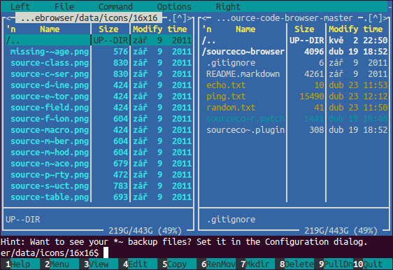

Složky a soubory
****************

Nejprve projdeme, jak vypadá organizace linuxového disku, nejdůležitější složky, soubory a jejich
význam. V druhé ve skrze praktické části budeme soubory a složky vytvářet, mazat, archivovat,
přesouvat ap.

Hlavní odlišnosti Linuxu
========================

Podívejme se na ty nejzásadnější odlišnosti souborů v Linuxu.

.. _skryte-soubory:

.. rubric:: Skryté soubory

Linux nezná skryté soubory. Existuje pouze konvence, že soubory nebo složky s tečkou na začátku
(např. již dobře známý ``.bashrc``) jsou považovány za skryté a většina programů je standardně při
práci se soubory nezobrazuje. Těmto "skrytým" souborům se proto říká *dot-files (tečkové soubory)*.

.. rubric:: Přípona neurčuje typ

Ve většině případů je přípona považována jen za součást názvu souboru a neovlivňuje, jak se se
souborem bude zacházet. Typ je určen na základě obsahu, nikoli jména. Pro většinu typů souborů se
zkontroluje několik prvních bajtů (hlavička souboru). Tomuto mechanizmu se říká *magic pattern* a
sami můžete zkusit, jak dobře tato detekce funguje příkazem ``file``.

.. rubric:: Neexistují jednotky

I když je souborový systém rozdělen na více disků nebo oddílů, z pohledu uživatele existuje jediná
stromově tvořená hierarchie. Neexistují tedy jednotky, resp. písmena jednotek. Disky či oddíly jsou
namapovány přímo na určitou složku.

.. rubric:: Rozlišuje se velikost písmen

Toto je asi nejznámější vlastnost i mezi lidmi, kteří se s Linuxem doposud nesetkali. Soubor
``dovolena.jpg`` je zcela jiným souborem, než ``dovolena.JPG``. Obecně se dá říct, že v Linuxu se
velikost písmen rozlišuje nejen u názvu souborů a složek, ale v podstatě všude jako např. v
konfiguračních hodnotách, klíčích, skriptech apod.

.. rubric:: Oddělovač cesty je ``/``

Jako oddělovač diskové cesty slouží běžné lomítko ``/`` (dopředné lomítko, forward slash), nikoli
``\`` (zpětné lomítko, backward slash).

.. rubric:: Složka je druh souboru

Mluvíme-li proto o souboru vždy informace platí i pro složky. Podobně mohou mít i složky přípony
(např. ``/etc/init.d/``).

Prohlídka stromu složek
=======================

Všechny složky jsou různě hluboko zanořené podsložky jediného *kořenu (root)* se jménem ``/``. Jak jsme již zmínili jako uživatel se nezajímáme, zda jsou tyto podsložky kořene na stejném nebo různých oddílech a discích.

Hierarchie a význam složek vyhází z unixové tradice a je popsána normou `Filesystem Hierarchy
Standard (FHS) <http://www.pathname.com/fhs/>`_. Tento standard dodržuje nejen Ubuntu a Debian, ale
i všechny velké hlavní distribuce.

.. note:: Názvy složek uvádíme vždy s ukončující ``/``, takže vždy bezpečně rozlišíte ``složku/`` od ``souboru``. Doporučujeme i vám dodržovat tuto konvenci.

Nejdůležitější složky stromu jsou následující:

* ``/`` -- kořen, root

  * ``/bin/`` -- binárky klíčových programů jako ls, mount, rm, ...
  * ``/boot/`` -- soubory jádra, bootloader, konfigurační soubory
  * ``/dev/`` -- virtuální složka zařízeních
  * ``/etc/`` -- konfigurace společná pro všechny uživatele
  * ``/home/`` -- domovské složky uživatelů kromě roota
  * ``/lib/`` -- základní sdílené knihovny a moduly jádra
  * ``/media/`` -- přípojné místo pro *externí a odjímatelné (removable) zařízení* jako externí USB
    pevné disky, CD mechaniky ap. V Ubuntu Desktop zde najdete vložené CD/DVD disky.
  * ``/mnt/`` -- přípojné místo pro *dočasně připojená* zařízení jako síťové disky ap. Zda zařízení
    připojit sem nebo do ``/media/`` je spíše konvence. Pro ruční připojování bývá tradičnější tato
    složka.
  * ``/opt/`` -- software, který instalujete manuálně mimo systém balíčků.
  * ``/proc/`` -- virtuální složka se systémovými informacemi zejm. o procesech
  * ``/root/`` -- root má tuto domovskou složku přímo v rootu ``/`` odděleně od ``/home/``
  * ``/sbin/`` -- důležité správcovské programy převážně určené výhradně pro roota jako fsck, halt,
    reboot, ifconfig ap.
  * ``/sys/`` -- virtuální složka pro zjištění nebo nastavení informací o jádře
  * ``/tmp/`` -- místo pro dočasné soubory a složky
  * ``/usr/`` -- uživatelské programy neboli většinou software instalovaný dodatečně po skončení
    instalace.

   * ``/bin/`` -- v případě GUI systémy jsou zde převážně grafické programy.
   * ``/lib/`` -- sdílené knihovny uživatelských programů
   * ``/share/doc/`` -- dokumentace programů (README, návody ap.) a manuálové stránky. V době před
     Googlem se hledali informace právě zde :-)

  * ``/var/`` -- data aplikací. Asi nejdůležitější složka pro zálohy. Jsou zde data všech
    instalovaných aplikací - soubory databázového serveru, HTML a skripty webových aplikací ap.

    * ``/log/`` -- logy aplikací a systému (jádra)
    * ``/www/`` -- Apache web server složka webových aplikací
    * ... - další složky podle instalovaných aplikací

  * ``/srv/`` -- plánováno jako datové adresáře služeb jako FTP, HTTP, ale není téměř využíváno a
    složka je většinou prázdná

.. _relativni-absolutni-cesta:

Relativní a absolutní cesta
===========================

Napíšte-li např. ``cd acc/2014/`` může to znamenat skok do ``/home/joe/acc/2014/``, 
``/home/lisa/Documents/acc/2014/``, ``/var/backups/acc/2014/`` atd. v závislosti na tom jaká byla
aktuální složka v době provádění ``cd``. Takto napsaná cesta bez počátečního ``/`` je **relativní**, tedy vyhodnocuje se podle místa, kde jste byli na začátku.

V relativní cestě můžeme použít symbolické složky ``..`` pro nadřazenou složku a ``.`` pro aktuální
složku. Např. cesta ``../../acc/2014/`` vede do ``/acc/2014/`` ve složce o dvě výš, než aktuální.
Aktuální složku ``.`` již znáte při spouštění programů např. ``./muj-skript``.

Naproti tomu ``cd /var/log/apache/`` je vždy jednoznačné a nezáleží na aktuální složce v době
volání ``cd``. Cesta s počátečním ``/`` je **absolutní** a platí vždy odkudkoliv.

Který způsob psaní cesty zvolit závisí na situaci. Měli byste však absolutní i relativní cesty
bezpečně ovládat a podle kontextu využívat jeden nebo druhý způsob určování diskové cesty.

Práce se soubory
================

Volné místo
-----------

df (disk free), ``-h`` jako human-readble jednotky (kiB, MiB, GiB)::

	df -h

Velikost složek
---------------

du (directory utilization), ``-h`` human-readable jednotky, ``-b`` velikost na disku místo pouhé
velikosti. Program vypíše velikosti aktuální složky. Výstup může být na více obrazovek, proto je
vhodné jej stránkovat v less::

	du -bf | less

Vytvoření složky
----------------

mkdir (make dir)::

	$ mkdir nova-slozka

Obdobou v MS-DOSu byl příkaz ``md``.

Užitečnou volbou je ``-p``, kdy příkaz vytvoří i neexistující složky::

	$ mkdir -p /neexistujici/slozky/budou/vytvoreny

Vytvoření souboru
-----------------

Soubory jsou vytvářeny převážně prostřednictvím aplikací. Čas od času se však hodí vytvořit prázdný
soubor::

	$ touch novy-soubor

Použití touch (dotkni se) na vytváření prázdných souborů je trochu "zneužití" tohoto programu, jehož
původní účel bylo aktualizovat čas poslední modifikace souboru. Využíváme však vlastnosti touch, že
pokud uvedený soubor neexistuje, je vytvořen.

Vymazání složky
---------------

rmdir maže složky, ale bohužel jen prázdné::

	$ rmdir prazdna-slozka

Proto se používá univerzálnější rm, který projdete rekurzivně (``-r, --recursive``) obsah a násilím
vymaže i neprázdné složky (``-f, --force``)::

	$ rm -rf neprazdna-slozka/

Vymazání souboru
----------------

::

	$ rm soubor

Kopírování
----------

Cp kopíruje standardně jen soubory a jen v přímé podúrovni (ne v podadresářích). Pokud nám to stačí, pak::

	$ cp odkud kam

Pro kopírování adresářů a podadresářů slouží volba ``-r, -R, --recursive`` (můžete si vybrat parametr, který se vám líbí nejvíce)::

	$ cp -r nejaka/slozka/ do/jine/slozky

Přesun a přejmenování
---------------------

Operace přesun a přejmenování jsou z technického pohledu identické. Příkaz mv (move) tedy můžeme
použít pro oba dva druhy změny::

	$ mv soucasny-nazev novy-nazev
	$ mv soubor ../zaloha/

Odkazy (linky)
==============

*Odkazy (links)* mohli unixům ostatní systémy dlouhou dobu jen tiše závidět. S odkazem pracujete
jako by se jednalo o originální soubor nebo složku. Díky tomu můžete vytvářet iluzi, že se stejný
soubor vyskytuje na více místech. Změna je tak nutná jen v originálu.

Linux rozlišuje dva druhy odkazů:

* operace nad **pevným odkazem (hard link)** se chovají jako by byli učiněny nad originálem. Smazání
  pevného odkazu znamená smazání originálu samotného.
* jako prevence nechtěného smazání originálu se proto mnohem častěji používají
  **symbolické odkazy (symlinks nebo soft links)**, kdy odkaz a originál existuje víceméně
  nezávisle. Musíme sami zajistit, aby se při přejmenování, přesunutí nebo smazání originálu nestali
  *neplatnými odkazy*, které nikam nesměřují.

Vytváření odkazů obstarává program ln. Bez parametru vytváří pevné odkazy::

  $ ln original odkaz
	
S parametrem ``-s`` bude odkaz symbolický::

	$ ln -s original symbolicky-odkaz
	
.. tip:: Cestu k originálu i odkazu doporučujeme uvádět absolutně.

Další výhoda symlinků oproti pevným odkazům je, že symlink může být na jiném zařízení (diskovém
oddílu), než originál na který odkazuje.

Pevné i symbolické linky uvidíte ve výpisu ``ls -l`` jako šipky na originál:

.. code-block:: none

	$ ls -l /etc/rc6.d/
	total 4
	lrwxrwxrwx 1 root root  13 úno  5 14:43 K01tlp -> ../init.d/tlp
	lrwxrwxrwx 1 root root  17 úno 23 13:52 K09apache2 -> ../init.d/apache2
	lrwxrwxrwx 1 root root  29 úno  5 12:12 K10unattended-upgrades -> ../init.d/unattended-upgrades
	lrwxrwxrwx 1 root root  18 úno  5 13:20 K20flexibee -> ../init.d/flexibee
	lrwxrwxrwx 1 root root  20 úno  5 12:12 K20kerneloops -> ../init.d/kerneloops
	lrwxrwxrwx 1 root root  27 úno  5 12:12 K20speech-dispatcher -> ../init.d/speech-dispatcher
	...

.. todo:: Jak od sebe poznat v "ls -l" symbolické a pevné linky? Jen symlinky maj šipky. Hardlink
   lze poznat jen tím, že na něj ukazuje více inodů (druhý sloupec)

Vyhledávání
===========

Na vyhledávání z příkazové řádky v Linuxu existujují tři hlavní nástroje.

find
----

Program find je jedním z nejsložitějších vůbec a množství voleb je doslova dech beroucí. Find dovede
vyhledávat na základě rozličných kritérií jako datum modifikace, vlastník, hloubka vnoření, velikost
větší, než atd. S vyhovujícími soubory umí kromě vypsání provádět i změny jako přejmenování,
vymazání atd. atd..

My zredukujeme bohaté možnosti find na hledání souboru nebo složky podle jména. Obecná syntaxe find
pro tento případ je::

	find <kde> [-type <f|d>] -name <výraz>

Jako kde uveďte místo začátku vyhledávání nebo prostě aktuální složku (.). Vynecháte-li ``-type``
úplně nebo uvedete ``-file f`` bude se hledat mezi běžnými soubory. Pro hledání mezi složkami slouží
``-file d``. Hledaný výraz může být prostý ("výkazy2014.ods" přesně) nebo obsahovat hvězdičky (vše
vyhovující "výkazy*.ods" jako "výkazy2014.ods", "výkazy2013.ods", ale i jen "výkazy.ods").

Hledání v aktuální složce souboru "chybejici"::

	$ find . -name "chybejici"
	
Hledání složky obsahující výraz "2013" kdekoli (root /)::

	$ find / -type d -name "*2013*"

locate
------

Když porovnáte rychlost hledání souborů nebo složek pomocí find a s program locate, tak zjistíte, že
locate hledá prakticky okamžitě::
	
	$ locate "2013"
	/home/lisa/Documents/acc/2013/
	/home/lisa/Documents/payroll2013.ods
	...
	
Jak je to možné? Locate nevyhledává soubory na disku, ale v průběžně vytvářené databázi. Tento index
je zpravidla aktualizován jednou denně. Locate tedy nenajde nedávno vytvořené soubory.

grep -r
-------

Poslední možností hledání vlastně již znáte. Program grep s volbou ``-r`` (rekurzivně) slouží pro
hledání *ne souborů, ale v obsahu souborů*. Volání můžete doplnit parametrem ``-i``, aby grep
nerozlišoval velikost písmen.

Hledání v aktuální složce::

	$ grep -ri "výraz"
	
Hledání v zadané složce::

	$ grep -ri "výraz" cesta/kde/hledat

Připravte se, že hledání v obsahu může trvat velmi dlouho.

.. _archivy-komprimace:

Archívy a komprimace
====================

Na začátek vysvětleme, jaký je rozdíl mezi archivací a komprimací (kompresí).

* *Archivace* je uložení více souborů a složek do jediného souboru pro snadnější manipulaci.
* *Komprimace (komprese)* je uložení více souborů a složek do jednoho nebo více souborů s cílem
  menší velikostí.

Běžným programem pro kompresi, resp. dekompresi je **gzip** a **gunzip**. Soubory mají většinou
příponu ``.gz`` nebo ``.gzip``.

.. warning:: Navzdory podobnému jménu nemají gzip/gunzip nic společného s komprimačním formátem ZIP
   (algoritmus PK-ZIP) a známým programem WinZip. Ale pracovat se ZIP soubory můžete i v Linuxu
   pomocí programů *zip a unzip*.

Méně se můžete setkat s komprimovanými soubory ``.bz2``, které mají lepší kompresní poměr, než
``.gz``, ale nejsou tak rozšířené. K vytváření a rozbalení byste použili programy **bzip2** a
**bunzip2**.

Tradičním unixovým programem pro archivaci je **tar** (tape archiver), který dnes samozřejmě používáme se běžnými soubory na disku místo páskovými mechanikami. Obvyklou příponou je ``.tar``. Tar však umí v jednom kroku soubory zkomprimovat i zaarchivovat (a obráceně). Takové soubory mají příponu ``.tar.gz``, ``.tgz`` pro tar+gz, resp. ``.tar.bz2`` pro tar+bzip2.

Časté volby taru jsou:

* ``v`` (verbose) -– činnost vypisovat na obrazovku
* ``z`` -– použít komprimaci/dekomprimaci gzip
* ``f`` -– přijímat vstup ze souboru, nikoli z STDIN

.. rubric:: Komprimace

::

	$ gzip velky-soubor

.. rubric:: Dekomprimace

::

	$ gunzip velky-soubor.gz

.. rubric:: Vytvoření archívu

Syntaxe::

	$ tar cvf <archiv>.tar [soubor | slozka]...

Např.::

	$ tar cvf archiv.tar soubor1 soubor2 slozka1 slozka2 slozka3/podslozka1

Pokud potřebujete vytvořit zkomprimovaný archív, pak přidejte parametr ``-z`` (gzip)::

	$ tar cvfz archiv.tar.gz soubor1 soubor2 slozka1 slozka2 slozka3/podslozka1

.. rubric:: Vypsání obsahu archívu

::

	$ tar tvf archiv.tar | less
	$ tar tvf archiv.tar.gz | less

.. rubric:: Rozbalení archívu

Tar archív (ne tar+gzip) rozbalíte do aktuální složky pomocí

	$ tar xvf archiv.tar

Jedná-li se o zkomprimovaný archív přidejte parametr +-z+ (unzip)

	$ tar xvfz archiv.tar.gz

Midnight Commander (mc)
=======================

Poté, co jsme se trápili s příkazy pro práci se soubory, archivaci, komprimaci a vyhledáváním, se
budete možná zlobit, že vám představíme mc jako poslední program této kapitoly.

Midnight Commander (mc) je souborový manažer vycházející ze slavného Norton Commanderu. V Ubuntu
není standardně a proto si ho nainstalujte a pak spušťte pomocí mc::

	$ sudo apt-get install mc
	$ mc

   Spása jménem Midnight Commander
