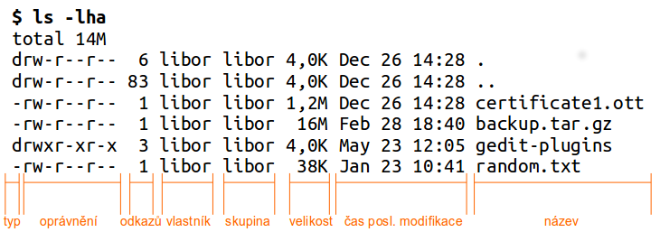

Souborová oprávnění
*******************

Linux a Unix jsou od počátku víceuživatelské systémy. Bylo tedy třeba od sebe jednotlivé uživatele a
jejich soubory "oddělit" a "ochránit" před ostatními. Systém souborových oprávnění na základě
identity uživatele a jeho členství ve skupinách je tím hlavním prostředkem.

.. _sady-opravneni:

Sady oprávnění
==============

Každý soubor nebo složka má přiřazeno **právě jednoho vlastníka** a **právě jednu skupinu**.
Oprávnění se samostatně nastavují pro

* *vlastníka* -- konkrétní uživatel
* *skupinu* -- uživatelé, kteří jsou členy konkrétní skupiny
* *svět* -- neboli všichni ostatní, kteří nejsou uživatelem ani členy skupiny

Druhy práv
==========

Soubor nebo složka má prvotně nastaveného vlastníka a skupinu na uživatele, který soubor vytvořil,
a jeho primární skupinu. Základní oprávnění nastavitelná pro každou tuto sadu uživatelů jsou

* *právo číst (read, r)*
* *právo zápisovat (write, w)*
* *právo spustit (execute, x)*

.. caution:: Pozor na to, že práva se chovají jinak pro soubor a jinak pro složku!

.. table:: Souborová práva

   +---------------+-----------------+--------------------------------------------------------------+
   | Právo         | Pro soubor      | Pro složku                                                   |
   +===============+=================+==============================================================+
   | číst (r)      | zobrazit soubor | zobrazit obsah složky (příkaz ls)                            |
   +---------------+-----------------+--------------------------------------------------------------+
   | zapisovat (w) | editovat soubor | vytvořit, přejmenovávat, přesouvat a mazat soubory ve složce |
   +---------------+-----------------+--------------------------------------------------------------+
   | spustit (x)   | spustit soubor  | vstoupit do složky nebo skrze projít (příkaz cd)             |
   +---------------+-----------------+--------------------------------------------------------------+

Vlastní skupina a oprávnění souboru jsou vidět v již důvěrně známém výpisu ``ls -l``.

   Výstup ls -l

Oprávnění je zapsáno symbolicky jako tři trojice pro vlastníka, skupinu a svět. Celkem tedy 9 znaků.
Zápis je vždy v pořadí rwx. Není-li právo přítomnné je uvedena místo práva pomlčka, např. ``r--``,
``rw-`` ap.

.. topic:: Poblázněná práva

   Ne všechny kombinace práv souborů a složek mají smysl. Hlavně práva složky dovedou s výslednými
   možnostmi práce zamíchat.

   Např. právo spustit lze nastavit na jakýkoli soubor, ale samozřejmě to má smysl jen na soubor,
   který je spustitelným programem. V Linuxu spustitelné programy většinou nemají žádnou příponu
   .exe ap. Spustitelné jsou ovšem často skripty, které můžou používat přípony jako .sh pro Bash,
   .py pro jazyk Python atd.

   Další příklad bláznivého výsledku je pro složku nastavit jen r nebo jen x -- nemůže-li do složky
   vstoupit (x), nemůže vypsat ani její obsah (r) a naopak. Výsledkem je, že i když jste vlastník
   vidíte při pokusu o cd nebo ls chybu *Permission denied*.

   Oprávnění pro složku "přebíjí" oprávnění na soubory. Pokud na složku máme oprávnění zapisovat
   můžeme zde smazat soubory i když k souborům právo zápisu nemáme. Podobně nemůžeme soubor
   modifikovat (třeba přejmenovat nebo editovat) i když na něj máme právo zápisu, ale nemáme ho na
   složku souboru.

Typické oprávnění pro složky je ``rwxr-xr-x`` (číselně /viz později/ vyjádřeno 755), tedy 
vlastníkovi umožňující cokoli, lidem ze skupiny a světu číst složku a vstoupit.

Typické oprávnění pro soubory je ``rw-r--r--`` (číselně 644), tedy vlastníkovi umožňující číst a editovat, skupině a světu jen soubor číst.

Číselné vyjádření oprávnění
===========================

Zkušenější správci kromě symbolického zápisu oprávnění používají i *číselné (oktalové) vyjádření*
[#okalove-vyjadreni]_ jako např. 644, 755, 777 ap. Výhodou tohoto způsobu je, že místo zápisu 
a čtení 6 znaků potřebujeme jen 3 číslice.

Převod ze symbolických práv na číselná spočívá jen v součtu hodnot jednotlivých práv.

.. table:: Hodnoty symbolických práv osmičkově

   +-------+------------------+
   | Právo | Oktalová hodnota |
   +=======+==================+
   | r     | 4                |
   | w     | 2                |
   | x     | 1                |
   | -     | 0                |
   +-------+------------------+

Nejlépe to pochopíte z příkladů:

+---------------+-----------+-----------+
| rw-           | r--       | ---       |
+---------------+-----------+-----------+
| 4 + 2 + 0     | 4 + 0 + 0 | 0 + 0 + 0 |
+---------------+-----------+-----------+
| 6             | 4         | 0         |
+---------------+-----------+-----------+
| **640 osmičkově**                     |
+---------------+-----------+-----------+

nebo

+---------------+-----------+-----------+
| rwx           | r-x       | r-x       |
+---------------+-----------+-----------+
| 4 + 2 + 1     | 4 + 0 + 1 | 4 + 0 + 1 |
+---------------+-----------+-----------+
| 7             | 5         | 5         |
+---------------+-----------+-----------+
| **755 osmičkově**                     |
+---------------+-----------+-----------+

SUID a SGID
===========

Kromě základních práv rwx bychom měli znát

* *právo SUID* (set user ID upon execution, nastav uživatele po spuštění) -- symbolicky "s"
* *právo SGID* (set group ID upon execution, nastavit skupina po spuštění) -- symbolicky "S"

Jakýkoli program, který spustíme, přebírá naše vlastní oprávnění. Nemůže tedy provést to, co my sami
nemůžeme. Je-li však na souboru programu nastaveno SUID nebo SGID právo, pak je spuštěn s právy
vlastníka (SUID) nebo skupiny (SGID).

Např. program :ref:`passwd <passwd>` může použít i běžný uživatel, který si chce změnit heslo sám
sobě. Jak už víte, je heslo uloženo jako hash hodnota v ``/etc/shadow``. Ne-superuživatel však právo
zápisu (editace) k tomuto souboru nemá (a nesmí mít). Tedy přestože passwd spouští omezený uživatel,
sám program passwd má práva roota, protože root je vlastníkem a na passwd je nastaveno SUID.
(Všimněte si písmena "s" napozici "x".)

::

	$ ls -l `which passwd`
	-rwsr-xr-x 1 root root 47032 čec 26  2013 /usr/bin/passwd

Tyto speciální práva mají nastaveny i další programy ping, crontab ap.

.. rubric:: SUID/SGID na složkách

Nastavení SGID na složku má zásadně odlišný význam, než na souboru:

1. Soubory vytvořené ve SGID složce dědí skupinu této složky, nikoli primární skupinu aktuálního
   uživatele.
2. Podsložky vytvořené ve SGID složce mají nastaveno také SGID právo.

Pokus o nastavení SUID na složku nemá význam a je ignorován.

Sticky bit
==========

Poslední a ještě "exotičtější" právo je sticky bit, který by snad šlo přeložit pro zasmání jako
"lepivý bit".  Symbolicky označovaný písmenem "t" pro složky, nebo "T" pro soubory (na ty však nemá
žádný vliv - viz dále).

.. note:: Význam sticky bitu, který dále popíšeme není původním smyslem tohoto oprávnění, tak jak
   platil(í) v Unixech HP-UX, UnixWare ap. Použití v dnešním Linuxu je úplně odlišné.

Je-li sticky bit nastaven na složce, pak zde jen vlastník složky (a root) může přejmenovat,
přesouvat a mazat soubory či podsložky.

Sticky bit je v Linuxu nastaven na složku ``/tmp/``, takže více uživatelů může do této složky
ukládat své dočasné soubory a přitom nemohou smazat soubory cizích uživatelů. (Všimněte si písmena
"t" na pozici "x".)

::

	$ ls -ld /tmp/
	drwxrwxrwt 18 root root 12288 kvě  4 18:17 /tmp

Pokus o nastavení sticky bitu na soubor nemá žádný význam a je ignorován.

Nastavení oprávnění -- chmod
============================

Příkazem chmod (change mode) modifikujeme oprávnění souborů a složek.

.. rubric:: Symbolicky zadávané oprávnění

Obecná syntaxe pro symbolický zápis vypadá::

	chmod <sada> (+ | - | =) <práva> <soubor/nebo/slozka>

Kde *<sada>* může být

* ``u`` pro vlastníka (user)
* ``g`` pro skupinu (group)
* ``o`` pro svět (others)
* ``a`` pro "všichni" (all)

Chceme-li nastavit práva např. pro vlastníka i skupiny, můžeme jako sadu uvést ``ug`` (user + group)
ap.

.. note:: Chmod bohužel nepoužívá terminologii "owner", "group", "world". Nepleťe si tedy ``o`` s
   vlastníkem (owner), který je pro chmod trochu podivně jako ``u`` (user).

Následuje operátor

* ``+`` pro přičtení práv k současným
* ``-`` pro odebrání práv od současných
* ``=`` pro nastavení stanovených práv

Práva zapisujeme již známým způsobem zkratkami r pro čtení, w pro zápis, a x pro spuštění.

Příklady:

.. code-block:: bash

   # Skupině přidat zápis
   $ chmod g+w soubor.txt

   # Vlastníkovi odebrat spuštění
   $ chmod u-x soubor.txt

   # Světu přidat čtení a odebrat spuštění
   $ chmod o+r-x soubor.txt

   # Všem nastavit právo čtení a spouštění
   $ chmod a=rx soubor.txt

   # Vlastníkovi a světu nastavit právo čtení a spuštění
   $ chmod uo=rx soubor.txt

.. rubric:: Oktalově zadávané oprávnění

Pro numerický oktalový zápis je syntaxe prostá::

	$ chmod 644 soubor.txt

.. rubric:: Rekurzivně

Pro obě podoby zadání oprávnění se často připojuje parametr ``-R, --recursive``, tedy oprávnění změň
na zadané složce, všech podsložkách a souborech v ní::

	$ chmod -R 400 slozka/

.. note:: Pozor na záměnu ``-R`` a ``-r``. Velké "R" muselo být zvoleno, protože "r" je
   interpretováno jako právo read.

Rekurzivně pracující chmod nastavuje zadané oprávnění na dceřiné soubory i složky. To ale není vždy 
to, co chceme. Pokud potřebujeme nastavit rekurzivně, ale jen na soubory nebo jen na složky, musíme
si vypomoci s find nebo možnostmi Bashe.

.. code-block:: bash

   # Nastavení všem souborům 644
   find . -type f -exec chmod 644 "{}" \;

   # Nastavení všem složkám 755
   find . -type d -exec chmod 755 "{}" \;

   # Nebo pomocí Bashe totéž pro složky
   chmod 755 $(find /path/to/base/dir -type d)

   # soubory
   chmod 644 $(find /path/to/base/dir -type f)

Změna vlastníka -- chown
========================

Syntaxe chown (change owner) je snadná. Chown taktéž dovede pracovat rekurzivně s ``-R``::

	$ chown -R lisa /home/lisa/

Protože je často měněn vlastník i skupina, má chown speciální syntaxi <vlastník>:<skupina> pro změnu
v jednom kroce::

	$ chown -R lisa:marketing /var/share/public/marketing

Změna skupiny -- chgrp
======================

Chgrp (change group) má stejnou syntaxe i chown a rovněž podporuje volbu ``-R`` pro rekurzivní
operaci::

	$ chgrp -R marketing /var/share/public/marketing/

Výchozí oprávnění -- umask
==========================

Možná vás už napadlo, jaká oprávnění budou mít vytvářené soubory, když "nějaká" mít musí a vy jste
je nemodifikovali (a většině případů ani asi nebudete). Obecná odpověď neexistuje, protože záleží na
programu, kterým složky a soubory zakládáme, ale seznámíme se s *většinou* platnými konvencemi.

Tradiční linuxové programy při vytváření souborů nastavují ``rw-rw-rw-`` ("dábělské" 666), a pro
složky ``rwxrwxrwx`` ("andělské" 777). Takto vytvořené soubory jsou čitelné a zapisovatelné pro
všechny a složky plně přístupné taktéž pro všechny. Když vytvoříme soubor, tak ale tato oprávnění
(naštěstí) nemá::

	$ touch soubor
	$ ls -l soubor
	-rw-r--r-- 1 libor libor       0 kvě  4 20:42 soubor

.. rubric:: Hodnota umask

Tradiční linuxové programy ctí hodnotu označovanou **umask** (user file creation mode mask), která 
se od těchto "plných" práv odečte. Hodnota umask se nastavuje stejnojmenným příkazem umask, ale
specifikujeme práva, která mít nově vytvářené soubory a složky mít *nemají*.

Umask bez parametrů hodnotu vypíše::

	$ umask
	0022

Hodnotu umask získáme odečtením požadovaného oprávnění od 777, ale umask podporuje i symbolické 
zadávání i zobrazování ve stejném formátu jako chmod.

Pozor, že výstup ``umask -S`` jsou práva, která *mají být, nikoli nesmí být* nastavena::

	$ umask -S
	u=rwx,g=rx,o=rx

.. rubric:: Nastavení hodnoty umask

Při nastavování nového masky umask si musíme uvědomit, že platí až od této chvíle a pro procesy
spuštěné ve stejném shellu. Při restartu nebo odhlášení se ztrácí a proto se umask nastavuje ve
startovacích skriptech

* např. ``~/.bashrc`` konkrétního uživatele
* nebo ``/etc/login.defs`` a ``/etc/environment`` pro všechny uživatele

.. topic:: Pravidla určení výchozího oprávnění a vlastnictví

   * nově vytvořený objekt patří uživateli, který ho vytvořil a primární skupině tohoto uživatele
   * nově vytvořený objekt má implicitně oprávnění určená příkazem umask
   * oprávnění může měnit vlastník objektu nebo správce systému (root)
   * vlastníka může měnit pouze root, v některých případech i majitel (za speciálních podmínek)
   * skupinu může měnit root, v některých případech i majitel (za speciálních podmínek)

   Operační systém nezasahuje do zapsaných údajů, pokud nemusí. Proto při přejmenování nedojde k
   ovlivnění oprávnění ani vlastníka či skupiny. Naopak při kopírování patří kopie tomu, kdo si ji
   vytvořil. Při přesunu záleží na tom, jestli je potřeba vytvořit nový i-uzel (inode) (při přesunu
   mezi různými souborovými systémy jde vlastně o kopírování s následným smazáním originálu) nebo
   nikoli (jde vlastně o variantu přejmenování).

   (`Zdroj Wikipedia <http://cs.wikipedia.org/wiki/P%C5%99%C3%ADstupov%C3%A1_pr%C3%A1va_v_Unixu#Pravidla>`_)

POSIX a ACL oprávnění
=====================

Právě vysvětlená oprávnění jsou označována někdy jako *tradiční* nebo *POSIX* oprávnění. Vznikala v
době, kdy autoři Unixu stáli před problémem vyřešit souborová oprávnění co nejjednoduššeji, protože
výkonnostní a paměťové limity počítačů byly velmi nízko.

Přesto tento POSIX model oprávnění téměř vždy vyhovuje, a proto je hojně využíván dodnes.

Nicméně jako alternativní k tomuto tradičnímu unixovému přístupu existují tzv. *ACL (Access Control
List, seznam oprávnění) modely*, které jsou podobné např. oprávněním známým z Windows. Na diskovou
položku nastavujeme seznam oprávnění pro neomezený počet uživatelů a skupin jednotlivě.

Vzhledem k velmi malému použití ACL oprávnění v praxi se tímto modelem nebudeme hlouběji zabývat.

.. todo:: něco o ACL na http://www.linuxexpres.cz/praxe/sprava-linuxoveho-serveru-pristupova-prava-a-acl

.. rubric:: Poznámky

.. [#okalove-vyjadreni] Neboli v osmičkové soustavě. Pozor na překlep: oktalové, nikoli oktanové :-)
