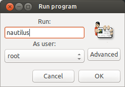
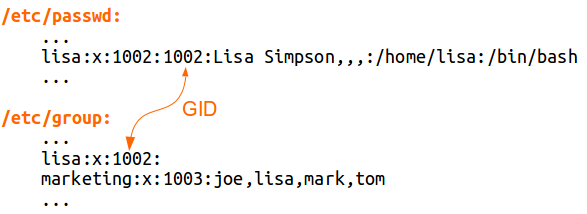

Uživatelé a skupiny
*******************

.. _root:

Superuživatel root
==================

Neomezenou mocí vládne superuživatel s uživatelským jménem root. Je to obdoba účtu "admin",
"Administrator" nebo "su" v jiných OS a softwarech.

.. caution:: Možná by vás napadlo v rámci zvýšení bezpečnosti nebo "přizpůsobení" přejmenovat účet
   root na "admin" nebo vytvořit nového superuživatele. To je sice technicky proveditelné, ale
   rozhodně vám to nedoporučujeme. Vytvoříte spíše nové zranitelnosti a kromě toho vás bude
   proklínat každý, kdo po vás bude muset server spravovat.

Root smí provádět provádět jakoukoli operaci s jakýmkoli souborem nebo procesem kromě nesmyslných operací, jako třeba spuštění souboru bez spustitelného bitu.

.. important:: Chtěli bychom vyzdvihnout slova *jakoukoli* a *jakýkoli*. Root v Linuxu je skutečně
   neomezený. Ne jako ve Windows, kdy jste sice administrátor, ale přesto nemůžete úplně svobodně
   některé operace se systémem provádět a musíte využívat různé triky přes Shift, runas ap.

Ovšem i přes svoji privilegovanost je to pořád účet jako každý jiný a mohli byste se chtít na něj
přihlásit a pracovat. Z důvodu naprosté neomezenosti tohoto účtu je to však nerozumné. Představte
si, že se překlepnete a protože jste root, smažete důležité soubory nebo znefunkčníte systém.
Některé distribuce jako Ubuntu vám to dokonce vůbec neumožní.

su -- změna identity
--------------------

Ve všech systémech kromě Ubuntu je výše uvedený problém vyřešen programem ``su``. Když ho spustíme
bez parametrů

::

	$ su

vyzve nás k zadání hesla roota a spustí shell (příkazovou řádku) s oprávněními roota.

.. caution:: V Debianu se na účet roota přepnout můžete, ale i tak to nedoporučujeme.

Můžeme přepínat i na jiné identity, než roota.

::

   $ su <uživatel>

a zadáte heslo tohoto uživatele. Nebo se můžeme přepnout nejprve na roota ``su`` a pak na
konkrétního uživatele ``su <uživatel>`` a nebudeme muset zadávat jeho heslo (root se může přepnout i
bez zadávání hesla daného uživatele).

sudo -- vylepšený su v Ubuntu
-----------------------------

Jak jsme si řekli, v Ubuntu se na roota nepřihlásíte (alespoň ve výchozím stavu). To ale neznamená,
že Ubuntu roota nemá. Jak tedy v Ubuntu provést úkoly vyžadující superuživatele?

Ubuntu uživatel root sice existuje, ale nemá žádné platné heslo. Tedy se na něj nikdy nemůžeme
přihlásit či přepnout. Namísto "přepínání" se na roota (nebo na jiný účet) si jen "vypůjčíme"
oprávnění tohoto účtu. Sudo je velmi bohatě konfigurovatelné v souboru ``/etc/sudoers``, kde najdete

* seznam uživatelů, kteří smí sudo používat
* jaké programy smí spouštět (dokonce i jaké parametry těmto programům mohou zadat)
* na jakých hostitelích smí tyto programy provádět
* pod jakým účtem se mají tyto příkazy provádět (nejčastěji root)

.. caution:: Příkaz sudo nás žádá o naše vlastní heslo, nikoli roota (resp. uživatele pod kterým se má program provést).

Výhody řešení přes sudo:

* existuje :ref:`log <var-log-auth.log>`, kdo, kdy a jaký příkaz spustil
* rootovské úkoly můžou provádět i uživatelé bez root oprávnění
* root oprávnění můžete uživateli odebrat bez změny root hesla
* skutečné heslo roota zná jen jeden či dva "vyvolení"

sudo -i
^^^^^^^

Tímto parametrem otevřeme root konzoli, abysme nemuseli stále opakovat před každým příkazem "sudo".
Nevýhodou však je, že příkazy zadané v rámci nové konzole nejsou :ref:`zalogovány
<var-log-auth.log>`.

gksudo
^^^^^^

Sudo se hodí pro spuštění s jinými oprávněními pouze pro textové (CLI) programy. Když chcete spustit
jako root (nebo jiný uživatel) grafickou aplikaci (GUI), je vhodné použít variantu gksudo::

	$ gksudo <program>

Nebo bez parametru ``gksudo`` můžete příkaz i identitu vybrat graficky.

Gksudo standardní součástí Ubuntu od verze 13.04. Doinstalovat gksudo můžeme příkazem::

	$ sudo apt-get install gksu

.. note:: Jestli náhodou používáte Kubuntu, tedy Ubuntu s KDE místo Gnome/Unity, pak se příkaz
   jmenuje ``kdesu``.

.. _var-log-auth.log:

Protokol /var/log/auth.log
^^^^^^^^^^^^^^^^^^^^^^^^^^

V tomto souboru najdeme zmíněnou historii příkazů provedených prostřednictvím sudo/gksudo.

Zobrazit např. posledních 10 záznamů můžeme pomocí::

   $ tail /var/log/auth.log

:ref:`Více o tail <head-tail>`.

Nevýhody sudo
^^^^^^^^^^^^^

Nevýhoda sudo přístupu je, že prolomení bezpečnosti "běžného" účtu s oprávněním provádět sudo může
mít stejný dopad jako prolomení účtu samotného roota. Dělat se s ním nedá nic kromě navádění
uživatelů sudo k ochraně účtu stejně jako by se jednalo o účet superuživatele.

Druhou nevýhodou může být obtížné :ref:`přesměrování výstupu <presmerovani>` výstupu "sudovaného" programu pomocí operátorů např. ``>``, ``>>``, ``|``. Např. když zkusíte vymazat ``error.log`` pomocí "černé díry" ``/dev/null``:

.. todo:: odkaz na kapitolu ve dvojce o /dev/null

::

   $ sudo cat /dev/null > /var/log/apache2/error.log

narazíme na *Permission denied*. Ale jak to, když se má příkaz provádět s právy roota?! Důvod je v
tom, že se jen část před operátor ``>`` provede jako root. Přesměrování totiž spustí nový subshell,
který již není "sudován". Celý příkaz musíme proto přepsat, aby se spustil naráz::

	$ sudo sh -c 'cat /dev/null > /var/log/apache2/error.log'

Přidání do sudoers
^^^^^^^^^^^^^^^^^^

Pro přidání mezi "sudoery" stačí uživatele přidat do skupiny sudo::

	$ sudo adduser <uživatel> sudo

Protože je :ref:`členství ve skupině <skupiny>` zjišťováno jen při přihlašování, musí se uživatel
odhlásit a přihlásit znovu, aby se oprávnění projevilo.

Tento postup místo přímé editace souboru ``/etc/sudoers`` funguje díky tomu, že je v tomto souboru
již nastaveno, že všichni uživatelé skupiny sudo mohou provádět jakýkoli příkaz a na jakémkoli
počítači.

.. code-block:: none
   :caption: Maximální povolení pro skupinu sudo v /etc/sudoers

   # Allow members of group sudo to execute any command
   %sudo   ALL=(ALL:ALL) ALL

Pro jakoukoli jinou konfiguraci, než jen pouhé přidání mezi sudoery, je třeba editovat soubor
``/etc/sudoers``. Nikdy to ale nedělejte na přímo otevřením v editoru, ale pomocí programu
``visudo``. Ten otevře konfigurační soubor v textovém editoru a zabezpečí, že jste jediný, kdo ho
bude v daný moment upravovat, a zejm. při ukončení editoru zkontroluje správnost syntaxe.

Uživatelé
=========

Ihned po dokončení instalace existují v systému dva účty "pro lidi" a dokonce až několik desítek
účtů pro :ref:`démony <demoni>` (služby běžící na pozadí) (v závilosti na vybraném software během
instalace).

Sami jistě správně odhadnete, že prvním lidským účtem je root (se kterým nemůžeme běžně pracovat) a
váš vlastní účet pro běžnou práci vytvořený během instalace.

Na další účty sloužící démonům se nelze přihlásit. Mají velmi omezená práva specifická pro jakého
démona mají sloužit. V Linuxu běžně každý démon běží pod přísně vyhrazeným a omezeným účtem.

.. important:: Pamatujte, že téměř jakékoli změny uživatele, skupiny, členství ve skupinách a z
   nich vyplývajících oprávnění se projeví až při opětovném přihlášení.

Soubory ``/etc/passwd`` a ``/etc/shadow``
-----------------------------------------

Soubor ``/etc/passwd`` je klíčovým konfiguračním souborem pro správu uživatelů. Obsahem je seznam
uživatelů systému:

* uživatelské jméno (username),
* heslo,
* user ID (UID) číslo,
* group ID (GID) číslo skupiny uživatele,
* dodatečné údaje (občanské jméno, číslo kanceláře, ap.),
* přihlašovací shell

.. tip:: UID 0 je rezervování pro roota. UID 1-999 by měly být vyhrazeny pro démony. Teprve od UID
   1000 by se mělo jedna o "lidské" účty.

Jednotlivé záznamy na řádcích jsou oddělené dvojtečkou.

.. code-block:: none
   :caption: Ukázka ``/etc/passwd`` (zkráceno)
   :emphasize-lines: 1, 13, 14

   root:x:0:0:root:/root:/bin/bash
   daemon:x:1:1:daemon:/usr/sbin:/bin/sh
   bin:x:2:2:bin:/bin:/bin/sh
   sys:x:3:3:sys:/dev:/bin/sh
   sync:x:4:65534:sync:/bin:/bin/sync
   games:x:5:60:games:/usr/games:/bin/sh
   man:x:6:12:man:/var/cache/man:/bin/sh
   lp:x:7:7:lp:/var/spool/lpd:/bin/sh
   mail:x:8:8:mail:/var/mail:/bin/sh
   news:x:9:9:news:/var/spool/news:/bin/sh
   uucp:x:10:10:uucp:/var/spool/uucp:/bin/sh
   ...
   joe:x:1000:1000:Joe Smith,,,:/home/joe:/bin/bash
   lisa:x:1001:1001:Lisa Simpson,,,:/home/lisa:/bin/bash

Možná jste zvedli obočí při informaci, že se v tomto souboru nachází heslo. To je a není pravda. V
dřevních dobách Unixu, zde opravdu bylo heslo v čitelné podobě, ale později začalo být ukládáno
zašifrovaně.

.. rubric:: Stínová hesla

V naší ukázce mají všichni uživatelé v poli hesla "x", což znamená, že jsou používána tzv. *stínová hesla (shadow passwords)*, kdy je heslo uloženo v odděleném souboru ``/etc/shadow`` [#f1]_.

Na rozdíl od ``/etc/passwd`` není tento soubor veřejně dostupný::

    $ ls -l /etc/passwd /etc/shadow
    -rw-r--r-- 1 root root   1989 dub 14 19:53 /etc/passwd
    -rw-r----- 1 root shadow 1325 dub 14 19:53 /etc/shadow

.. code-block:: none
   :caption: Ukázka ``/etc/shadow`` (zkráceno)

   root:!:16106:0:99999:7:::
   daemon:*:15994:0:99999:7:::
   bin:*:15994:0:99999:7:::
   sys:*:15994:0:99999:7:::
   sync:*:15994:0:99999:7:::
   games:*:15994:0:99999:7:::
   man:*:15994:0:99999:7:::
   lp:*:15994:0:99999:7:::
   mail:*:15994:0:99999:7:::
   news:*:15994:0:99999:7:::
   ...
   joe:$6$xhD/uG2q2dcqDG5M$2J3kIis1IU9PXaFI7WRhBBKRfEgFc2ERP.kv3LEOsTzzx/NK9ANAjn5wpIT93PG5.uCxcQ90bvgmUKz1b6bL61:16106:0:99999:7:::
   lisa:$6$ZR/Ld5EzJMaEpP8LA$h8FWBii.Zz/ZRWnwncWg.BsvxpPZS0Z2fQj7DS9LAW0QyuN8TCYlFSTXg9dDFwjFlCu7EPwDg2RlAjzerk.Qv/:16106:0:99999:7:::

Heslo uživatele je zde uloženo jako *hash (otisk, digest)*, tedy z hash řetězce nelze nijak odvodit
jaké bylo původní heslo. Hash je znovu vypočten při přihlašování a porovnán s hodnotou v
``/etc/shadow``.

.. note:: Konkrétní hešovací algoritmus se liší. Tradiční DES a MD5 postupně nahrazuje např.
   bezpečnější SHA-512, které používá i Ubuntu.

Pokud zde není hash, ale ``!`` nebo ``*``, pak je znemožněno se tímto účtem přihlásit. Vykřičník
před hashem znamená zamčený účet (taktéž se není možné přihlásit).

Je-li zde prázdný řetězec, považuje se to za prázdné heslo (bez heslo), ale ne všechny aplikace jsou
na variantu prázdného hesla připraveny.

Další pole souboru ``/etc/shadow`` jsou (rovněž oddělené dvojtečkou):

* datum poslední změny hesla
* minimální počet dní mezi změnami hesla
* maximální počet dní mezi změnami hesla
* počet dní předem varování, že si musíme heslo změnit
* počet dní po vypršení hesla, po kterých bude účet zablokován
* datum vypršení hesla
* poslední pole je rezervováno pro budoucí využití

Datumy se uvádějí jako počet dní od 1. ledna 1970.

Vytvoření uživatele -- adduser
------------------------------

Na základě předchozích znalostí bysme uměli umět založit uživatele manuálně, ale jistější a
pohodlnější způsob je použít ``adduser <uživatel>``, postupně odpovědět na otázky programu a nakonec potvrdit správnost :kbd:`Y` (Yes)::

	$ sudo adduser lisa
	Adding user `lisa' ...
	Adding new group `lisa' (1002) ...
	Adding new user `lisa' (1002) with group `lisa' ...
	Creating home directory `/home/lisa' ...
	Copying files from `/etc/skel' ...
	Enter new UNIX password:
	Retype new UNIX password:
	Changing the user information for lisa
	Enter the new value, or press ENTER for the default
	Full Name []:
	Room Number []:
	Work Phone []:
	Home Phone []:
	Other []:
	Is the information correct? [Y/n] y

.. important:: V jiných systémech stejnou práci obstarává ``useradd``. I když tento skript také
   existuje v Ubuntu/Debian, preferujeme vždy ``adduser``.

Přejmenování uživatele
----------------------

Když dojde k nutnosti přejmenovat uživatele (např. z důvodu svatby) použijeme jednu z mnoha funkcí
programu ``usermod``::

	$ sudo usermod -l <nový-username> <současný-username>

Pozor na to, že domovská složka zůstane stále stejná. Musíme ji přejmenovat ručně a upravit v ``/etc/passwd``.

Zjištění identity uživatele -- id, whoami
-----------------------------------------

Aktuálního uživatele a jeho skupiny ve kterých je členem zjistíte pomocí ``id``.

Pouze jméno aktuálního uživatele zjistíte pomocí ``whoami``.

Vymazání uživatele -- deluser
-----------------------------

Smazání je opět možné provést ručně, ale rychlejším způsobem je využít ``deluser <uživatel>``::

 	$ sudo deluser lisa

Skript vymaže uživatele (z ``/etc/passwd`` a ``/etc/shadow``), ale **nevymaže domovskou složku, mail spool a soubory vlastněné uživatelem.**. Připojte parametr

* ``--remove-home`` pro odstranění domovské složky
* ``--remove-all-files`` pro odstranění všech souborů vlastněných uživatelem (tedy i domovské
  složky)

Soubory uživatele je před odstraněním vhodné zazálohovat do :ref:`zkomprimovaného archívu <archivy-komprimace>` parametrem ``--backup``, který vytvoří v aktuální složce soubor ``<uživatelské_jméno>.tar.gz``.

.. important:: V jiných systémech stejnou práci zařizuje ``userdel``. I když tento skript existuje
také v Ubuntu/Debian, zde preferujeme vždy ``deluser``.

.. todo:: Přidat odkaz do II do SSH s textem "Přestože SSH popisujeme v ____pokračování___ této
   příručky, zmínímě důležitý aspekt..."

.. topic:: Smazání uživatele a SSH přístup

   Vymazání uživatele nebo jen jeho uzamčení se nevztahuje na další způsoby přihlašování, zejm.
   SSH! Pokud má uživatel přístup přes SSH s veřejným klíčem, může se nadále přihlásit. Proto

   1. smažeme jeho domovskou složku nebo jen soubor ``~/.ssh/authorized_keys``.
   2. ukončíme všechny existující SSH spojení daného uživatele.

   Lepším řešením je však omezit přístup přes SSH na skupinu např. ``sshlogin``, přidat tuto
   skupinu pomocí ``AllowGroups`` v ``/etc/ssh/sshd_config``. Následně postačí jen uživatele ze
   skupiny ``sshlogin`` odebrat a restartovat SSH démona neboli::

       $ sudo adduser <username> sshlogin
       $ sudo service ssh restart

.. _skupiny:

Skupiny
=======

Soubor ``/etc/group``
---------------------

Obsahem souboru ``/etc/group`` je seznam skupin a seznam členů těchto skupin.

Jednotlivá pole oddělená dvojtečkou mají tento význam:

* název skupiny
* heslo skupiny
* group ID (GID) číslo skupiny
* členové skupiny oddělené čárkou

.. warning:: Členové skupiny jsou odděleni opravdu jen čárkou ("joe,lisa"), nikoli čárkou a mezerou
   ("joe, lisa")!

.. code-block:: none
   :caption: Ukázka /etc/group (zkráceno)

   root:x:0:
   daemon:x:1:
   bin:x:2:
   sys:x:3:
   adm:x:4:joe
   tty:x:5:
   disk:x:6:
   lp:x:7:
   mail:x:8:joe,lisa
   news:x:9:
   ...
   joe:x:1000
   lisa:x:1001:

.. note:: Skupina může mít heslo (když se přepínáme na skupinu programem ``newgrp``), ale využití
   této možnosti v praxi a tím pádem i hesla skupiny je téměř nulové. Pro hesla skupin existuje
   mechanizmus podobný stínovým heslům v souboru ``/etc/gshadow``, kde je většinou nastaveno ``*``,
   tj. "nelze se přihlásit".

Primární a sekundární členství
------------------------------

Možná jste si při kontrole souborů ``/etc/passwd`` a ``/etc/group`` po vytvoření uživatele povšimli,
že zde byla vytvořena skupina se stejným názvem, jako je název uživatele. Tato skupina se jmenuje *primární (či osobní) skupina* a právě založený uživatel je jejím jediným členem.

Uživatel má svou primární skupinu uvedenou přímo v ``/etc/passwd`` jako číselné GID (může zde být
uvedena jen jediná skupina pomocí GID). Čerstvě po vytvoření uživatele nemá tato skupina žádné další
členy v ``/etc/groups``.

Naproti tomu členové uvedení v ``/etc/groups`` mohou nazývat takovou skupinu jako *sekundární
(secondary nebo supplementary)*.

   Primární a sekundární skupina z pohledu konfiguračních souborů.

.. note:: Z pohledu oprávnění a jakýchkoli dalších efektů jsou oba druhy členství prakticky
   rovnocenné. Jediný rozdíl je, že nově vytvářené soubory a složky dostávají přiřazenou vaši
   primární skupinu jako :ref:`skupinu souboru <sady-opravneni>`.

Vytvoření skupiny
-----------------

Pro vytvoření skupiny slouží příkaz ``addgroup <skupina>``::

	$ sudo addgroup marketing

Přidání uživatele do skupiny
----------------------------

::

	$ sudo adduser <username> <skupina>
	$ sudo adduser lisa marketing

Výpis členství ve skupinách
---------------------------

Aktuálního uživatele::

	$ groups
	joe adm mail sudo lpadmin sambashare marketing

Jiného uživatele::

	$ groups lisa
	joe adm mail sudo lpadmin sambashare marketing management

Vymazání skupiny
----------------

::

	$ sudo deluser --group marketing

nebo identický výsledek bude mít

::

	$ sudo delgroup marketing

.. warning:: Nelze odstranit primární skupinu existujícího uživatele!

Odstranění uživatele ze skupiny
-------------------------------

::

	$ sudo deluser <uživatel> <skupina>
	$ sudo deluser lisa management

Externí databáze - LDAP, NIS
============================

Všechny doposud popsané informace platily pouze lokálně, tj. účty a skupiny existují výhradně na
místním počítači a není způsob, jak by mohl stejný účet nebo skupina existovat či se ověřovat se
stejným heslem a sdílet oprávnění na více počítačích stejné sítě.

K dosažení skutečně sdíleného účtování je potřeba začít používat systémy jako LDAP nebo NIS, které
přesouvají konfiguraci na externí centrální databáze a jednotlivé stroje jsou klienty tohoto
centrálního serveru.

Vzhledem ke značné rozsáhlosti a faktu, že většina studentů bude spravovat maximálně jednotky
instalací se nebudeme LDAP a NIS zabývat.

Správa hesel
============

.. _passwd:

Nastavení hesla
---------------

Pomocí programu passwd si uživatel sám sobě nebo správce uživateli může nastavit heslo. Pokud
odpovídá politice hesel (viz dále), bude přijato.

Uživatel sám sobě::

	$ passwd

Správce jinému uživateli::

	$ sudo passwd <uživatel>

.. Q: Passwd musí modifikovat /etc/passwd, resp. /etc/shadow. Jak to, že to tento program může
   provést, když běžný uživatel nemůže např. /etc/shadow ani zobrazit?

Zamčení účtu
------------

S hesly souvisí i možnost uzamknout účet. Je to mírnější varianta vymazání účtu. Veškeré soubory,
nastavení a oprávnění zůstávají, ale uživatel se ke svému účtu nemůže přihlásit.

Zamčení ``-l`` (lock)::

	$ sudo passwd -l <účet>

Odemčení ``-u`` (unlock)::

	$ sudo passwd -u <účet>

Politika hesel
--------------

Správná hesla by měla odpovídat zabezpečovanému systému. Můžete proto vyžadovat určitou minimální
délku, složitost, neopakování hesel, nebo časově omezená hesla (expirace).

.. rubric:: PAM

Toto všechno je možné pomocí tzv. PAM (PAssword Management) modulu, který je konfigurován pomocí
souborů v ``/etc/pam.d/`` složce. Zmíněná minimální délka hesla se např. nastavuje v souboru ``/etc/pam.d/common-password``.

.. rubric:: Expirace hesla

Aktuální dobu do vypršení hesla zjistíte ``sudo chage -l <uživatel>``. Bez parametru ``sudo chage <uživatel>`` budete postupně dotazování na jednotlivá nastavení..

.. rubric:: Poznámky

.. [#f1] Není nám známá distribuce, která by používala starý systém ukládání hesel.
